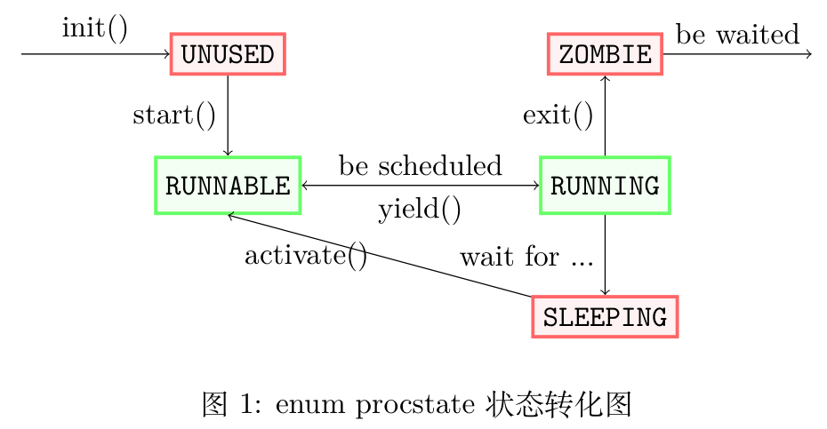
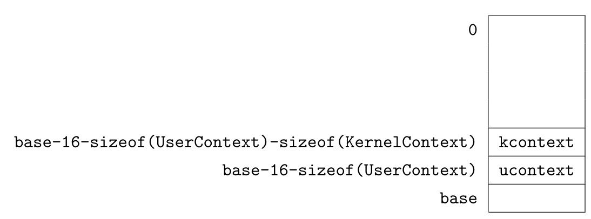

# OS Lab API Reference（继承自去年）

<center><b>2023 年 9 月 18 日</b></center>

内核框架中提供了大量的接口，为方便同学查阅，特撰写本 API Reference。（有些接口的代码需要自行补全，请以 lab 要求为准）

API Reference 以模块顺序组织 API，正式记载的 API 以正式条目形式列出，非正式记载的 API 以简要形式列出。只有在特殊情况下才应使用非正式记载的 API。

API Reference 仅列出在 lab 中可能使用到的 API，亦不包含 API 的实现细节。如有兴趣了解未写出的内容，请联系助教。

[TOC]


# **\<aarch64/intrinsic.h\>**

## **cpuid**

返回当前的 CPUID。

**Syntax** `int cpuid()`

**Return Value** 当前的 CPUID，取值为 0、1、2、3。

## **compiler_fence**

编译器屏障，阻止编译器重排屏障前后的代码。

**Syntax** `void compiler_fence()`

## **arch_isb**

指令屏障，清空流水线。

**Syntax** `void arch_isb()`

## **arch_dsb_sy**

数据屏障，阻止处理器重排屏障前后的访存。

**Syntax** `void arch_dsb()`

## **arch_fence**

指令 & 数据屏障，相当于 isb+dsb。

**Syntax** `void arch_fence()`

## **device_put_u32**

向 MMIO 地址写入 4 字节数据。

**Syntax** `void device_put_u32(u64 addr, u32 value)`

**Parameters**

- addr 要写入数据的 MMIO 地址

- value 要写入的 4 字节数据

**Remarks** device_put_u32与直接指针写入的区别在于，device_put_u32 通过编译器屏障和volatile关键字禁止编译器对写入的优化。

## **device_get_u32**

从 MMIO 地址读取 4 字节数据。

**Syntax** `u64 device_get_u32(u64 addr)`

**Parameters**

- addr 要读取数据的 MMIO 地址

**Remarks** device_get_u32与直接指针读取的区别在于，device_get_u32 通过编译器屏障和volatile关键字禁止编译器对读取的优化。

## **arch_wfi**

暂停处理器执行，等待中断发生。

**Syntax** `void arch_wfi()`

**Remarks** 暂停时处理器处于低功耗状态（qemu 不会模拟这一点）。

## **arch_yield**

提示处理器可以适当暂停执行当前代码，常用于spinlock。

**Syntax** `void arch_yield()`

**Remarks** 一般用于支持硬件线程（Intel 称 Hyperthread 技术）的处理器， 提示处理器进行任务切换（qemu 不会模拟这一点）。

## **arch_with_trap**

默认情况下，内核不开启中断。arch_with_trap标记表示代码块在开启中断的情况下执行，常与arch_wfi配合使用。

**Syntax** `arch_with_trap { ... }`

## **delay_us**

延时若干微秒后返回，延时期间不能执行其他代码（除非开启中断）。

**Syntax** `void delay_us(u64 n)`

**Parameters**

-   n 延时的微秒数

## **set_return_addr**

修改当前函数的返回地址。

**Syntax** `#define set_return_addr(addr)`

**Parameters**

-   addr 任意可转换为u64的类型，值为要设置的返回地址。

## **(Undocumented)**

-   `bool _arch_enable_trap()` 开启中断。返回值为之前的中断开关状态。
-   `bool _arch_disable_trap()` 关闭中断。返回值为之前的中断开关状态。
-   `void arch_set_vbar(void* ptr`) 将当前 CPU 的异常向量基地址设置为指定虚拟地址。一般情况下，只应在set_cpu_on中为每个 CPU 执行一次。
-   `void arch_reset_esr()` 清零 esr 寄存器，复位异常信号。
-   `u64 get_timestamp()` 获取时间戳。单位由处理器决定。

# \<aarch64/mmu.h\>

## **K2P**

获取内核虚拟地址对应的物理地址。

**Syntax** `#define K2P(addr)`

**Parameters**

- addr 任意可转换为u64的类型，为要转换的内核虚拟地址。

**Return Value** u64类型，为对应的物理地址。

## **P2K**

获取物理地址对应的内核虚拟地址。

**Syntax** `#define P2K(addr)`

**Parameters**

- addr 任意可转换为u64的类型，为要转换的物理地址。

**Return Value** u64类型，为对应的内核虚拟地址。

## **P2N**

获取物理地址对应的物理页号。

**Syntax** `#define P2N(addr)`

**Parameters**

- addr 任意可转换为u64的类型，为要转换的物理地址。

**Return Value** u64类型，为对应的物理页号。

## **PAGE_BASE**

获取内存地址对应的页基地址。

**Syntax** `#define PAGE_BASE(addr)` 

**Parameters**

- addr 任意可转换为u64的类型，为要获取页基地址的内存地址。

**Return Value** u64类型，为对应的页基地址。如果内存地址是虚拟地址，返 回虚拟页基地址；如果内存地址是物理地址，返回物理页基地址。

## **PTE_ADDRESS**

获取页表项对应的下一级页表或物理页的物理地址。

**Syntax** `#define PTE_ADDRESS(pte)`

**Parameters**

- pte u64类型，页表项。

**Return Value** u64类型，页表项对应的下一级页表或物理页的物理地址。 这个宏只取出页表项的相应位数据，不检查页表项是否有效。无效的页表项的PTE_ADDRESS没有意义。

## **N_PTE_PER_TABLE**

每一级页表中含有的页表项数量。lab 中为 512。

## **PTE_TABLE**

指示页表项为下一级页表。

## **PTE_VALID**

指示页表项有效。

**Remarks** PTE_VALID一般用于测试页表项是否有效，在配置页表项时使用PTE_VALID是没有意义的。

## **PTE_USER_DATA**

指示页表项为用户数据页。

**Remarks** 用户数据页大小为 4K，可缓存，可在用户态读写。

# aarch64/swtch.S

## **(Undocumented)**

-   `void swtch(KernelContext* newctx, KernelContext** oldctx)` 进行上下文切换，newctx 为要切换到的上下文，oldctx 将在调用结束后被设置为指向原上下文的指针。该函数未在头文件中出现，需要手动声明。如无特殊情况，只应该在 sched 函数中使用 swtch 。
# aarch64/trap.S

## **(Undocumented)**

-   `trap_entry` trap 的入口代码，将 trap 发生处的上下文保存到栈上， 然后调用 trap_global_handler。trap_entry 只被注册到中断向量表， 一般情况下不会出现手动调用。
-   `trap_return` trap 的返回代码，紧跟着 trap_entry，从栈上恢复 trap 发生处的上下文，然后执行 eret。trap_return 只在 trap_entry 返回后自然执行，或内核态进程转入用户态时作为入口代码使用，一般情况下不会出现手动调用。

# aarch64/trap.c

## **trap_global_handler**

trap 的通用处理函数。该函数将判断esr.ec，根据不同 trap 类别（中断、系统调用、异常等）分发给不同处理函数处理。对于未知类型的 trap， 触发 PANIC。

**Syntax** `void trap_global_handler(UserContext* context)`

**Parameters**

-   context trap 发生处的上下文，由 trap 入口代码给出，一般保存在栈上。

**Remarks** 该函数未出现在头文件中，一般只由 trap_entry 调用，返回后执行 trap_return。

trap 返回时，还会检查进程的 killed 标记。被标记为 killed 的进程在返回用户态时会执行 exit。

# \<common/checker.h\>

## **Checker**

Checker 是配对检查器，可以与 setup_checker、checker_begin_ctx 和 checker_end_ctx 配合使用。setup 在当前的变量作用域中定义 checker，beginctx 和 endctx 分别可以为 checker 增加或减少计数。若 checker 在其生命周期（可参考 C++ 中的概念）终止时计数恒为 0（即 beginctx 和 endctx 间形成配对），则编译通过，否则会报 Checker: contextmismatching 编译错误。

一般不会单独使用配对检查器，而是将其与需要配对检查的函数组合使用，如通过宏在acquire_lock中内置 beginctx 操作，在release_lock中内置 endctx 操作，即可检查是否存在忘记放锁的情况。

可以为配对检查器注册结束回调函数。当 checker 计数归零时，会执行注册的回调函数，并清除回调函数。

以下示例代码供参考

```c
// test1 无法通过编译，qwq处于函数作用域，其生命周期在函数返回时终止
//代码显然不能保证函数返回时qwq计数恒为0（ begin_ctx 和 end_ctx 形成配对）
void test1 (int x)
{
    setup_checker (qwq) ;
    checker_begin_ctx (qwq) ;
    if(x == 0)
    	return ;
    checker_end_ctx (qwq) ;
}

// test2 无法通过编译，因为qwq处于 else 的块级作用域，生命周期在 else 块结束时终止
//else 块结束时 qwq 计数显然不为0，而且后面的 end_ctx 中 qwq 是未定义的
void test2 (int x)
{
    if(x == 0)
    	return ;
    else
    {
        setup_checker (qwq) ;
        checker_begin_ctx (qwq) ;
    }
    checker_end_ctx (qwq) ;
}

// test3 可以通过编译，虽然有些复杂，但可以看出qwq计数最终恒为0
void test3 (int x)
{
    setup_checker (qwq) ;
    checker_begin_ctx (qwq) ;
    while(x)
    {
        checker_end_ctx (qwq) ;
        if(−−x < 0)
        	return ;
        checker_begin_ctx (qwq) ;
    }
    checker_end_ctx (qwq) ;
}

// test4 将输出 ’bac’
void test4 ()
{
    setup_checker(qwq) ;
    checker_begin_ctx(qwq) ;
    checker_set_delayed_task(qwq, putch, ’a’ ) ;
    putch(’b ’) ;
    checker_end_ctx(qwq);
    checker_begin_ctx(qwq);
    putch (’c’) ;
    checker_end_ctx(qwq);
}
```

## **setup_checker**

定 义 并 初 始 化 配 对 检 查 器 。

**Syntax** `#define setup_checker(id)`

**Parameters**

-   id 任意数字、字母和下划线的组合，为自定义的检查器 ID。

## **checker_begin_ctx**

增加配对检查器计数。

**Syntax** `#define checker_begin_ctx(id)`

**Parameters**

-   id 要增加计数的检查器 ID。

## **checker_end_ctx**

减少配对检查器计数。

**Syntax** `#define checker_end_ctx(id)`

**Parameters**

- id 要减少计数的检查器 ID。

**Remarks** 当计数归零时，会执行结束回调函数，并清除结束回调函数。

## **checker_set_delayed_task**

注册结束回调函数。结束回调函数会在 checker 清零后被调用，并在调用后被清除。一次只能注册一个结束回调函数。

**Syntax** `#define checker_set_delayed_task(id, f, a)`

**Parameters**

-   id 要注册结束回调函数的检查器 ID。
-   f 结束回调函数的指针。
-   a 结束回调函数的参数。

## **(Undocumented)**

-   `checker_begin_ctx_before_call(id, f, ...)` 增加检查器计数，然后调用指定函数。返回所调用的指定函数返回值
-   `checker_end_ctx_after_call(id, f, ...)` 调用指定函数，然后减少检查器计数，会执行结束回调函数。返回所调用的指定函数返回值。

# \<common/defines.h\>

## **auto**

声明变量时自动推导类型，用法同 C++11auto。

## **MIN**

计算 min。

**Syntax** `#define MIN(a, b)`

**Parameters**

- a、b为任意可比较大小的变量。

**Return Value** a、b间的较小值。

## **MAX**

计算 max。

**Syntax** `#define MAX(a, b)`

**Parameters**

- a、b为任意可比较大小的变量。

**Return Value** a、b间的较大值。

## **BIT**

计算 2 的幂。

**Syntax** `#define BIT(i)`

**Parameters**

-   i为 0-63 的整数。

**Return Value** $2^i$。

## **container_of**

通过结构体成员的指针获取结构体的指针。

**Syntax** `#define container_of(mptr, type, member)`

**Parameters**

- mptr 结构体成员的指针。

- type 结构体类型名。

- member mptr对应的结构体成员名。

**Return Value** mptr对应的type类型结构体指针。

**Remarks** 下面示例代码有助于理解

```c
struct {int a, b;};
struct c x;
int ∗y = &x.b ;
struct c ∗z = container_of(y , struct c, b); // z == &x
```

## **PANIC**

触发 PANIC。内核 PANIC 后，将输出触发 PANIC 的代码**在源文件中的位置**，并尝试终止所有 CPU。

**Syntax** `#define PANIC()`

**Remarks** 调度器在发现有 CPU 触发 PANIC 后，会尝试将当前 CPU 调度到 idle 进程上，让 idle 进程执行清理和终止 CPU 的流程。如果 PANIC 发生在调度器相关代码中，因为全局调度器锁的影响，其他 CPU 很可能不能顺利终止，而是发生对调度器锁的死等待。

事实上，PANIC 相关的代码实现在 kernel/core.c 和调度器中，此处将其定义在 common/defines.h 中主要是考虑到其通用性。

## **ASSERT**

进行判断。如果条件不成立，触发 PANIC。

**Syntax** `#define ASSERT(expr)`

**Parameters**

-   要判断的条件。

## **(Undocumented)**

-   `NO_BSS` 修饰变量。指示编译器不要将该函数放入 .bss 段。为变量赋初值也可达到一样的效果，且是更为推荐的做法。
-   `NO_RETURN` 修饰函数。提示编译器该函数不会返回，可能导致编译器采取一些更激进的优化策略。
-   `ALWAYS_INLINE` 修饰函数。提示编译器该函数可能不会被用到，并指示编译器每次用到该函数时都将其内联。
-   `NO_INLINE` 修饰函数。指示编译器不要将该函数内联。

# \<common/list.h\>

## **ListNode**

ListNode 是一个内嵌式的双向链表节点，分别使用 ListNode.prev 和 ListNode.next 进行前向和后向访问。

一般将ListNode嵌入其他数据结构中，如

```c
struct a {
	int something;
	ListNode list;
};
```

(struct a).list 连接成双向链表，可以借助提供的 container_of 得到 struct a 。

容易看出，链表不是并发安全的数据结构。因此，我们将一些链表操作的 API 设计为了需要传入一个锁的形式，以免遗忘。如需使用不带锁的版本，可参考 (Undocumented) 中带下划线的版本。

## **init_list_node**

初始化链表节点。

**Syntax** `void init_list_node(ListNode *node)`

**Parameters**

- node 要初始化的链表节点。

**Remarks** 链表节点会被初始化为自环。

## **merge_list**

将两个链表合并为一个。

**Syntax** `#define merge_list(lock, node1, node2)`

**Parameters**

- lock spinlock，函数在执行合并操作前后会自动取得和释放这个锁。

- node1、node2 要合并的两个链表指针。

**Remarks** 合并效果如下所示

```
before: (arrow is the next pointer)
... --> node1 --> node3 --> ...
... <-- node2 <-- node4 <-- ... 

after:
... --> node1 --+ +-> node3 --> ...
				+ +
... <-- node2 <-+ +-- node4 <-- ...
```

## **insert_into_list**

将节点插入链表。

**Syntax** `#define insert_into_list(lock, list, node)`

**Parameters**

- lock spinlock，函数在执行插入操作前后会自动取得和释放这个锁。

- list 被插入的链表指针。

- node 要插入的链表节点指针。无需初始化节点。

**Remarks** 节点会被插入到链表的后面，即 `list->next=node`。

## **detach_from_list**

将节点从链表中删除。

**Syntax** `#define detach_from_list(lock, node)`

**Parameters**

- lock spinlock，函数在执行删除操作前后会自动取得和释放这个锁。

- node 要删除的链表节点指针。

**Return Value** 返回被删除的链表节点前面的元素，即原先的node-\>prev。如果 node 是链表中唯一的元素，返回 NULL。

## **\_for_in_list**

一个语法糖，用于遍历链表。

**Syntax** `_for_in_list(p, list) { ... }`

**Parameters**

- p 循环变量，为链表节点的指针。

- list 指向被遍历的链表指针。

- { ... } 循环体，类似于 for，可以使用 break 和 continue。

**Remarks** 在没有 break 的情况下，遍历从 list-\>next 开始，list 结束，链表中的每个节点都会被遍历一次。**这个遍历不是并发安全的，需要手动加锁。**可以参考下面示例代码

```c
void print_list (ListNode ∗list , SpinLock ∗lock )
{
    setup_checker(qwq);
    acquire_spinlock(qwq, &lock);
    _for_in_list (node, list)
    {
    	printf("List Element: %p\n", node) ;
    }
    release_spinlock (qwq, &lock);
}
```

另外，和 C++ 中的 `for(auto x : list)` 语法一样，**在遍历过程中插入或删除节点可能导致混乱**，请务必小心。如删除当前循环变量指向的节点后，你需要手动将其更新，参考代码 `p=_detach_from_list(p)` 。

## **\_empty_list**

测试链表是否只有一个节点。

**Syntax** `#define _empty_list(list)`

**Parameters**

- list 要测试的链表指针。

**Return Value** bool 型，若链表只有一个节点，返回 true，否则返回 false。

**Remarks** 如需与其他操作配合使用，请**注意并发安全问题**。如

```c
if (!_empty_list(list)) do something
```

不能保证 do something 的时候 list 中仍然只有一个元素。

## **QueueNode**

QueueNode 是一个内嵌式的**无锁队列**（无需加锁即可保证并发安全）节 点，其内嵌式声明方式与 ListNode 类似，但需要作为队列头的 QueueNode\* 指针，且不能自行访问队列中的元素，只能使用给定的几个操作。

QueueNode 及其队列头的使用可参考下面代码

```c
QueueNode ∗head = NULL;
QueueNode x;
add_to_queue(&head , &x); // x is added to the queue
QueueNode ∗y = fetch_from_queue(&head); // y == &x, and head == NULL now
```

队列操作要求使用**指向队列头的指针**（即QueueNode \*\*），操作过程中会**更改队列头的值**。

## **add_to_queue**

向队列中加入节点。

**Syntax** `QueueNode* add_to_queue(QueueNode** head, QueueNode* node)`

**Parameters**

- head 指向队列头的指针。如前所述，队列头为QueueNode\*类型。

- node 要加入队列的节点。无需初始化节点。

**Return Value** Unused.

## **fetch_from_queue**

从队列中取出一个元素。

**Syntax** `QueueNode* fetch_from_queue(QueueNode** head)`

**Parameters**

- head 指向队列头的指针。如前所述，队列头为QueueNode\* 类型。

**Return Value** 指向取出的队列节点的指针。可以使用 container_of 得到对应的元素。

**Remarks** 虽然名字叫队列，但其实是按照**栈顺序（先进后出）**取出的。

## **fetch_all_from_queue**

取出队列中的所有元素。

**Syntax** `QueueNode* fetch_all_from_queue(QueueNode** head)`

**Parameters**

- head 指向队列头的指针。如前所述，队列头为QueueNode\*类型。

**Return Value** 指向一个队列节点的指针，可以将该节点作为单向链表头节点使用，遍历所有取出的元素。可参考下面示例代码

```c
void fetch_and_print_all (QueueNode∗∗ head )
{
    for(QueueNode∗ p = fetch_all_from_queue(head); p; p = p->next)
        printf("Queue Element : %p\n", p) ;
}
```

**注意：**上面代码绝对不能写成 f(QueueNode\* x) 然后在f中使用 &x，因为这样队列操作时更改的是f的形参，不是真正的队列头变量！

## **(Undocumented)**

-   `_merge_list`、`_insert_into_list`、`_detach_from_list` 同不带开头下划线的相应版本，但没有加锁和解锁的步骤，不保证并发安全。

# \<common/rc.h\>

## **RefCount**

RefCount是一个内嵌式的引用计数结构，可以使用RefCount.count访问计数的值，但请注意直接修改计数不是并发安全的，你应该使用提供的原子操作函数increment_rc和decrement_rc。

## **init_rc**

初始化引用计数结构体。

**Syntax** `init_rc(RefCount* rc)`

**Parameters**

-   rc 要初始化的 RefCount 结构体指针。

## **increment_rc**

执行引用，即引用计数加一。

**Syntax** `#define increment_rc(checker, rc)`

**Parameters**

-   checker Checker 名，用于检查引用与解引用是否配对。
-   rc 指向要增加引用计数的 RefCount 结构体的指针。

们要求所有引用操作与解引用操作形成配对。如有特殊需求，可以自行使用beginctx/endctx 增减 checker 计数，也可使用带下划线的无 checker 版本（不推荐）。

## **decrement_rc**

执行解引用，即引用计数减一。

**Syntax** `#define decrement_rc(checker, rc)`

**Parameters**

- checker Checker 名，用于检查引用与解引用是否配对。

- rc 指向要减少引用计数的 RefCount 结构体的指针。

**Remarks** 执行解引用操作会同时减少所给 checker 的计数。一般情况下， 我们要求所有引用操作与解引用操作形成配对。如有特殊需求，可以自行使用 beginctx/endctx 增减 checker 计数，也可使用带下划线的无 checker 版本（不推荐）。

## **(Undocumented)**

-   `_increment_rc`、`_decrement_rc` 同不带开头下划线的相应版本，但参数中不含 checker，不会进行配对计数和执行配对检查。

# \<common/sem.h\>

## **Semaphore**

Semaphore是一个基础的信号量结构体，结构体所占空间需要自行分配，或选择内嵌用法。信号量的规则与 POSIX 信号量（可以自行学习一下POSIX 标准的信号量，之后 OS 的理论课程也会有相关讲解）基本一致，并补充了一些其他操作，方便二次开发。

信号量的核心是一个int变量，称为信号量的值。当信号量的值为 0 时，

为初始状态，没有可用的资源，也没有等待的进程。当信号量的值大于 0 时， 资源可用，没有进程正在等待，其绝对值代表可用的资源数量。当信号量的值小于 0 时，资源不可用，有进程正在等待，其绝对值代表等待资源的进程数量。

信号量有P、V两个基本操作。执行 V 操作，代表增加信号量对应的可用资源，信号量的值加一，然后若信号量的值小于等于 0，则唤醒一个等待中的进程。执行 P 操作，代表获取信号量对应的资源，信号量的值减一，然后若信号量的值小于 0，则进程进入等待状态。

进程的等待和唤醒需要调度器支持，因此**不能在 early init 和 init 阶段使用信号量的 PV 操作**。

## **init_sem**

初始化信号量结构体。

**Syntax** `void init_sem(Semaphore* sem, int val)`

**Parameters**

-   sem 要初始化的信号量结构体的指针。
-   val 信号量的初始值。

## **post_sem**

执行 V 操作。

**Syntax** `#define post_sem(sem)`

**Parameters**

- sem 要操作的信号量的指针。

**Remarks** 执行 V 操作后，会立即唤醒一个正在等待信号量的进程（若有），因此请注意并发问题，即：被唤醒的进程可能在post_sem函数返回之前就开 始执行。进程的等待和唤醒需要调度器支持，因此**该函数不能在 early init 和 init 阶段使用**。

## **wait_sem**

执行 P 操作。

**Syntax** `#define wait_sem(sem)`

**Parameters**

- sem 要操作的信号量的指针。

**Return Value** bool型。若成功完成 P 操作，返回 true。若在等待过程中被打断，返回 false。

**Remarks** 若目标信号量没有可用资源，将导致进程进入 SLEEPING 状态。SLEEPING 状态下，进程可能被 signal 强制唤醒，此时wait_sem返回 false， 且不会改变信号量的值。调用者应当对此情况做出合适的处理，尤其是对请求系统调用的用户进程而言，**必须通过返回到用户态等方式处理 signal**。进程的等待和唤醒需要调度器支持，因此**该函数不能在 early init 和 init 阶段使用**。

## **unalertable_wait_sem**

同wait_sem，但没有返回值，不会在过程中被 signal 打断。

**Syntax** `#define unalertable_wait_sem(sem)`

**Parameters**

- sem 要操作的信号量的指针。

**Remarks** 该函数不能被 signal 打断，对于可能被用户程序调用的代码，请注意**严格控制该函数的使用**，保证 kill 操作的时效性。

## **get_sem**

尝试执行 P 操作。如果不能立即完成，返回失败。

**Syntax** `#define get_sem(sem)`

**Parameters**

- sem 要操作的信号量的指针。

**Return Value** bool型。若信号量的值大于 0（有可用资源，无需等待），则执行 P 操作并返回 true，否则不做任何操作并返回 false。

## **get_all_sem**

获取信号量对应的所有可用资源（即：在不等待的情况下执行尽可能多的 P 操作），返回获取资源的数量。

**Syntax** `int get_all_sem(Semaphore* sem)`

**Parameters**

- sem 要操作的信号量的指针。

**Return Value** int型。若信号量的值大于 0，则将其清零并返回清零前的值（获取所有可用资源），否则不做任何操作并返回 0。

## **post_all_sem**

唤醒正在等待信号量的所有进程，给出相应数量的资源，返回给出资源的数量。

**Syntax** `int post_all_sem(Semaphore* sem)`

**Parameters**

- sem 要操作的信号量的指针。

**Return Value** int型。若信号量的值小于 0，则将其清零并返回清零前的值的绝对值（唤醒所有等待中的进程），否则不做任何操作并返回 0。

**Remarks** 该操作全程持有信号量锁，能够保证 postall 执行过程中不会有其他 PV 操作，且唤醒的进程在 postall 执行结束后才会返回。

## **SleepLock**

SleepLock（睡眠锁）是对 Semaphore 的二次封装，提供了一套可以对标于 SpinLock（自旋锁）的接口。SleepLock 和 SpinLock 的形式和功能几乎 完全一致，只是底层实现不同：SleepLock 会使进程陷入等待，调度到其他 进程，而 SpinLock 则进行轮询，不调度到其他进程。

与信号量相同，睡眠锁**不能在 early init 和 init 阶段使用**。

## **init_sleeplock**

初始化睡眠锁。

**Syntax** `#define init_sleeplock(lock)`

**Parameters**

-   sem 要初始化的睡眠锁的指针。

## **acquire_sleeplock**

取得睡眠锁。如果需要等待，会调度到其他进程。如果在等待过程中被 signal 打断，不取锁并返回 false。

**Syntax** `#define acquire_sleeplock(checker, lock)`

**Parameters**

-   checker 检查器。用于检查 acquire 与 release 是否配对。
-   lock 要取得的睡眠锁的指针。

**Return Value** 返回bool型，若成功取得睡眠锁则为 true，若在等待过程中被打断为 false。

## **unalertable_acquire_sem**

同acquire_sleeplock，但没有返回值，不会在过程中被 signal 打断。

**Syntax** `#define unalertable_acquire_sleeplock(checker, lock)`

**Parameters**

- checker 检查器。用于检查 acquire 与 release 是否配对。

- lock 要取得的睡眠锁的指针。

**Remarks** 该函数不能被 signal 打断，对于可能被用户程序调用的代码，请注意**严格控制该函数的使用**，保证 kill 操作的时效性。

## **release_sleeplock**

释放睡眠锁。

**Syntax** \#define release_sleeplock(checker, lock)

**Parameters**

-   checker 检查器。用于检查 acquire 与 release 是否配对。
-   lock 要释放的睡眠锁的指针。

## **(Undocumented)**

-   `lock_sem(checker, sem)` 锁定信号量。信号量锁定期间，其他 PV 操作不会进行，被唤醒的进程也不会返回。
-   `unlock_sem(checker, sem)` 解锁信号量。
-   `_post_sem(sem)` 执行 V 操作。post_sem中内含了锁定和解锁信号量的操作，该函数没有。调用此函数必须先锁定信号量。
-   `prelocked_wait_sem(checker, sem)` 执行 P 操作并解锁已经提前锁定的信号量。调用此函数必须先锁定信号量。
-   `prelocked_unalertable_wait_sem(checker, sem)` 执行 P 操作并解锁已经提前锁定的信号量。与prelocked_wait_sem的区别在于等待过程中不会被打断，请注意严格控制使用。

-   `_get_sem(sem)` 尝试执行 P 操作，如需阻塞，返回 false。get_sem中内含了锁定和解锁信号量的操作，该函数没有。调用此函数必须先锁定信号量。
-   `_query_sem(sem)` 读取信号量的值。调用此函数必须先锁定信号量。

# \<common/spinlock.h\>

## **SpinLock**

SpinLock是一个自旋锁结构体，与本节中的一组函数配合使用。自旋 锁是一种最简单的锁，通过原子操作轮询锁的标志实现，轮询期间 CPU 会一直处于占用状态。对于极短时间操作，使用自旋锁效率很高，但也容易浪费 CPU 资源，不适合较长时间操作使用。

与所有其他锁一样，使用锁时，请务必注意**死锁问题**。

## **init_spinlock**

初始化自旋锁。

**Syntax** `void init_spinlock(SpinLock* lock)`

**Parameters**

-   lock 指向要初始化的自旋锁结构体的指针。

## **try_acquire_spinlock**

尝试取得自旋锁。如果不能立刻取得自旋锁，则返回失败。

**Syntax** `#define try_acquire_spinlock(checker, lock)`

**Parameters**

- checker Checker 名，用于检查取锁与放锁操作是否配对。

- lock 指向要尝试取得自旋锁的 SpinLock 结构体的指针。

**Return Value** bool 型，如果成功取得自旋锁，返回 true。如果不能立即取得自旋锁，放弃并返回 false。

**Remarks** 如果成功取得自旋锁，会增加 checker 计数。

## **acquire_spinlock**

轮询直到成功取得自旋锁。

**Syntax** `#define acquire_spinlock(checker, lock)`

**Parameters**

- checker Checker 名，用于检查取锁与放锁操作是否配对。

- lock 指向要取得自旋锁的 SpinLock 结构体的指针。

**Remarks** 此操作会增加 checker 计数。轮询可能浪费较多 CPU 时间，仅应在耗时极少的任务上使用此方式。

## **release_spinlock**

释放自旋锁。

**Syntax** `#define release_spinlock(checker, lock)`

**Parameters**

- checker Checker 名，用于检查取锁与放锁操作是否配对。

- lock 指向要释放自旋锁的 SpinLock 结构体的指针。

**Remarks** 此操作会减少 checker 计数。

## **(Undocumented)**

-   `_try_acquire_spinlock`、`_acquire_spinlock`、`_release_spinlock` 同不带开头下划线的相应版本，但参数中不含 checker，不会进行配对计数和执行配对检查。

# **\<common/string.h\>**

## **memset**

功能、参数、返回值与 C 标准库中的同名函数相同。

**Syntax** `void *memset(void *s, int c, usize n)`

## **memcpy**

功能、参数、返回值与 C 标准库中的同名函数相同。

**Syntax** `void *memcpy(void *restrict dest, const void *restrict src, usize n)`

**Remarks** 与 C 标准库中相同，memcpy不能处理 dest 与 src 重叠的情况，memmove可以。

## **memcmp**

功能、参数、返回值与 C 标准库中的同名函数相同。

**Syntax** `int memcmp(const void *s1, const void *s2, usize n)`

## **memmove**

功能、参数、返回值与 C 标准库中的同名函数相同。

**Syntax** `void *memmove(void *dest, const void *src, usize n)`

## **strncpy**

功能、参数、返回值与 C 标准库中的同名函数相同。

**Syntax** `char *strncpy(char *restrict dest, const char *restrict src, usize n)`

**Remarks** 与 C 标准库相同，此处的 n 将字符串末尾的\\0计入在内。如对于字符串"hello"，复制时需设置n\>=6，否则字符串末尾的\\0不会被复制， 复制是不完整的。

## **strncpy_fast**

功能、参数、返回值与strncpy基本一致，区别在于：若 src（含末尾\\0在内）的长度小于 n，strncpy会在 dest 末尾填 0 直至总计写入了 n 个字节的数据，而strncpy_fast不会继续填 0。

**Syntax** `char *strncpy_fast(char *restrict dest, const char *restrict src, usize n)`

## **strncmp**

功能、参数、返回值与 C 标准库中的同名函数相同。

**Syntax** `int strncmp(const char *s1, const char *s2, usize n)`

## **strlen**

功能、参数、返回值与 C 标准库中的同名函数相同。

**Remarks** 与 C 标准库相同，strlen 不计字符串末尾的\\0，如"hello"的 strlen=5。

**Syntax** `usize strlen(const char *s)`

# **\<common/rbtree.h\>**

提供 rbtree 的基础函数，即插入，删除，查找。其他函数可以根据嵌入的结构体自己定制，和普通二叉查找树相同。rbtree 实现原理见算法导论。rbtree 还有可拓展部分，这里只实现了必要骨架和基础函数，可自行拓展。具体使用见测试文件 rbtreetest.c。

rbtree **不是并发安全的**，你可能需要自行为相关操作加锁。

## **rb_node\_**

rbtree 节点，内嵌在结构体内使用，和链表用法类似。包含左右子树节点指针，父节点指针和本节点颜色。

rb_node被定义为指向rb_node_的指针，一般都使用rb_node。

**Remarks** 结构体大小为 8 的倍数，按标准其地址应保证 8 字节对齐，可用指针低位来放颜色信息，便于节省内存。

## **rb_root\_**

root 节点，代表一棵 rbtree 的根。内部成员为根节点的指针。

rb_node被定义为指向rb_root_的指针，一般都使用rb_root。

## **\_rb_insert**

将 node 指向节点插入 rbtree 中并维护 rbtree 性质。

**Syntax** `int _rb_insert(rb_node node, rb_root root, bool (*cmp)(rb_node lnode, rb_node rnode))`

**Parameters**

- node 为要插入的点的指针。

- root 为 rbtree 的根。

- cmp 为比较函数指针，需自行定义**小于符号**。

**Return Value** 插入成功返回 0。若已经存在该元素，则失败并返回-1。

**Remarks** 记得加锁。

## **\_rb_erase**

删除 node 指向的节点并维护 rbtree 性质。

**Syntax** `void _rb_erase(rb_node node, rb_root root)`

**Parameters**

- node 为要删除的点的指针。

- root 为 rbtree 的根。

**Remarks** 记得加锁

## **\_rb_lookup**

查找与 node 中 key 相同的 node。

**Syntax** `rb_node _rb_lookup(rb_node node, rb_root rt, bool (*cmp)(rb_node lnode, rb_node rnode))`

**Parameters**

- node 为要查找的点的指针。

- rt 为 rbtree 的根。

- cmp 为比较函数指针，需自行定义**小于符号**。

**Return Value** 返回找到的 node 指针，若未找到返回 NULL。

**Remarks** 记得加锁。

## **\_rb_first**

**Syntax** `rb_node _rb_first(rb_root root)`

**Parameters**

- root 为 rbtree 的根。

**Return Value** 指向 rbtree 的中序第一个点的指针。

**Remarks** 记得加锁

# **\<common/ipc.h\>**

ipc 消息队列。使用示例见测试。

## **sys_msgget**

根据 key 获取或创建一个消息队列。

**Syntax** `int sys_msgget(int key, int msgflg)`

**Parameters**

- key 为查找的名称，类似文件名。

- msgflg 有 IPC_CREATE，IPC_EXCL 两位组成，前者指定没有此 key 的队列则创建，后者指定一定不存在此 key 队列。

**Return Value** 成功返回大于等于 0 的序列号，类似于文件描述符，失败返回小于 0 的错误码。

**Remarks** key=0 表示创建的队列是此进程独占的，一定会创建一个新的消息队列。消息队列的总数有限，为 16 个。目前不可动态倍增。超出大小无法分配会返回对应的错误码。

## **sys_msgsnd**

向一个消息队列中发送消息。当消息队列容量满时会睡眠。

**Syntax** `int sys_msgsnd(int msgid, msgbuf* msgp, int msgsz, int msgflg)`

**Parameters**

- msgid 为要送入消息的队列号。

- msgp 为消息，指向一片内核内存，前 4 个 byte 为消息类型，大于 0， 后面跟着消息本体。

- msgsz 为消息本体大小，不包括 4byte 的消息类型。

- msgflg 有 IPC_NOWAIT 指定在需要阻塞时是否直接返回。

**Return Value** 成功返回 0，失败返回错误码。

**Remarks** 消息类型要大于 0.

## **sys_msgrcv**

从一个消息队列中接收一个指定类型的消息。当没有满足条件的消息时会睡眠。

**Syntax** `int sys_msgrcv(int msgid, msgbuf* msgp, int msgsz, int mtype, int msgflg)`

**Parameters**

- msgid 接收消息的队列的序列号。

- msgp 消息缓冲区指针，消息将被复制到这里。

- msgsz 消息缓冲区大小，不包括 4byte 消息类型。消息超出此大小会返回错误。

- mtype 接收消息的类型，0 为队列中第一个消息，正数为等于 mtype 的消息，负数为消息类型小于此绝对值中的最小消息类型消息。

- IPC_WAIT 设置此位则没有此消息则直接返回不阻塞。

**Return Value** 成功返回接受消息的大小，失败返回错误码。

## **sys_msgctl**

管理消息队列。

**Syntax** `int sys_msgctl(int msgid, int cmd)`

**Parameters**

- msgid 将管理的消息队列序列号

- cmd 管理命令，目前只有 IPC_IDRM，移除一个消息队列。

**Return Value** 成功返回 0. 失败返回错误码。

**Remarks** 删除队列会唤醒所有的发送阻塞和接收阻塞进程，让其返回对应错误码。

# **\<kernel/mem.h\>**

## **struct page**

物理内存页的管理信息

**Syntax** 

```c
struct page
{
	RefCount ref;
}
```

**Members**

-   ref 物理页的引用计数，表示当前有多少虚拟地址在引用这块页，为零时才真正释放对应页。

## **kalloc_page**

分配物理页，并将物理页计数置为一

**Syntax** `void* kalloc_page()`

**Return Value** 指向所分配的物理页的指针。如果系统中没有空余的物理页，返回 NULL。

## **kfree_page**

释放物理页，并将物理页计数减一

**Syntax** `void kfree_page(void* p)`

**Remarks** 物理页计数为 0 时才真正释放这个页

## **left_page_cnt**

返回剩下的物理页数量

**Syntax** `u64 left_page_cnt()`

## **get_zero_page**

返回全零页的地址

**Syntax** `void* get_zero_page()`

**Remarks** 该页会被多个虚拟页引用，需要保证只读不写

## **check_zero_page**

检查是否全零页内容为全零

**Syntax** `bool check_zero_page()`

## **write_page_to_disk**

将一页物理地址写到磁盘 swap 分区上

**Syntax** `u32 write_page_to_disk(void* ka)`

**Parameters**

- ka 内核（虚拟）地址

**Return Value** 磁盘上的起始块块号，一页对应连续的八个块

## **read_page_from_disk**

从磁盘 swap 分区上读取一页

**Syntax** `void read_page_from_disk(void* ka, u32 bno)`

**Parameters**

-   ka 内核（虚拟）地址，读取的目标地址，需要保证地址有效
-   bno 页存放在磁盘上的起始块块号

## **kalloc**

分配内存块。类似于 C 标准库中的 malloc。

**Syntax** `void* kalloc(isize size)` 

**Parameters**

-   size 要分配的内存块的大小。**必须保证大小在 1-PAGE_SIZE/2（lab 中是 2048）之间**。

**Return Value** 指向所分配的内存块的指针。如果无法分配指定大小的内存块，返回 NULL。

**Remarks** kalloc可能会调用kalloc_page获取物理页。

## **kfree**

释放内存块。类似于 C 标准库中的 free。

**Syntax** `void kfree(void* p)`

**Parameters**

- p 指向要释放的内存块的指针，该内存块必须是使用kalloc分配的。

**Remarks** 调用者不需要告知 kfree 所释放的内存块大小。这些信息应该已 经被kalloc用适当的方法保存，就像 C 标准库的做法一样。

kfree 可能会整理内存碎片并调用 kalloc_free 释放空闲的物理页。

# **\<kernel/paging.h\>**

## **struct section**

用户进程的段信息

**Syntax** 

```c
struct section
{
    u64 flags;
    SleepLock sleeplock;
    u64 begin;
    u64 end;
    ListNode stnode;
}
```

**Members**

-   flags 段的状态信息，包括是否被 swap，是否对应磁盘上的文件
-   sleeplock 段的睡眠锁，主要用来保证高时延的swapout和swapin不会同时发生
-   begin 段的起始虚拟地址，按页对齐
-   end 段的结束虚拟地址，按页对齐
-   stnode 段的链表节点

## **init_sections**

初始化进程的所有段

**Syntax** `void init_sections(struct section* head)`

**Parameters**

-   head 段的链表头结点

## **free_sections**

释放进程所有的段

**Syntax** `void free_sections(struct pgdir* pd)`

**Parameters**

- head 段对应的进程页表

**Remarks** 对应的段可能需要先 swapin ，然后再释放段引用的页；也可以直接在磁盘上释放

## **pgfault**

进程触发缺页异常时的流程

**Syntax** `int pgfault(u64 iss)`

**Parameters**

- iss 是 page fault 时的错误代码信息

**Return Value** 返回处理结果情况，可以自定义

## **swapout**

将段换出到磁盘 swap 分区上

**Syntax** `void swapout(struct pgdir* pd, struct section* st)`

**Parameters**

- pd 段对应的进程页表

- st 要换出的段

**Remarks** 函数中需要先将段标记为已 swap，然后拿到段的睡眠锁，确保不会和swapin同时发生

## **swapin**

将段从磁盘 swap 分区换到内存中

**Syntax** `void swapin(struct pgdir* pd, struct section* st)`

**Parameters**

- pd 段对应的进程页表

- st 要换入的段

**Remarks** 先拿到段的睡眠锁，确保不会和swapin同时发生，然后将段标记 为未 swap

## **alloc_page_for_user**

为用户进程申请物理页

**Syntax** `void* alloc_page_for_user()`

**Remarks** 需要确保剩下的页表大于一个阈值 REVERSED_PAGES 留给内核用， 否则需要调用 swapou t空出一些页面

## **sbrk**

系统调用，用户进程申请增长/减少堆地址

**Syntax** `u64 sbrk(i64 incre)`

**Parameters**

-   incre 申请增长/减少的页数量

**Return Value** 修改前堆（程序的一个段）的 end

**Remarks** 增长和减少都是按页为单位的，需要要做到 lazy allocation。

# **\<kernel/pt.h\>**

## **struct pgdir**

用户空间的内存信息。

**Syntax** 

```c
struct pgdir
{
    PTEntriesPtr pt;
    SpinLock lock;
    ListNode section_head;
    bool online;
}
```

**Members**

- pt 用户空间的页表指针，初始化为 NULL。一般指向用户空间（低地址）的 0 级页表。如果进程没有用户空间，或尚未创建用户空间，则该值为 NULL。

- lock 页表的锁，保护页表的 online 信息和段的状态信息

- section_head 将段section连起来的头指针

- online 表示该页表是否被使用，swapout会使用，attach_pgdir会修改

**Remarks** 后续会逐渐添加内容，将用户页表抽象出一个 struct，就是为了后面扩展。

## **init_pgdir**

初始化 pgdir。

**Syntax** `void init_pgdir(struct pgdir* pgdir)`

**Parameters**

- pgdir 要初始化的 pgdir 的指针。

**Remarks** 一般情况下，只需要在 init_proc 中调用此函数，还需要初始化程序的段。

## **free_pgdir**

销毁 pgdir 描述的用户空间，释放占用的所有物理页。

**Syntax** `void free_pgdir(struct pgdir* pgdir)`

**Parameters**

- pgdir 要销毁的 pgdir 的指针。

**Remarks** 销毁用户空间时，应释放页表所占用的所有物理页，并将 pgdir

内的页表指针置为 NULL。需要销毁段和段所引用的物理地址。

## **attach_pgdir**

将系统中当前的用户空间改为 pgdir 所描述的用户空间。

默认情况下，系统中当前的用户空间为正在运行的进程的用户空间，你可以调用该函数切换到其他的用户空间，然后直接使用目标用户空间中的用户地址访问数据，但请**注意地址的合法性问题**，并**注意在访问完毕后将用户空间改回当前进程的用户空间**。

**Syntax** `void attach_pgdir(struct pgdir* pgdir)`

**Parameters**

- pgdir 描述要设置的当前用户空间的 pgdir 的指针。

**Remarks** 该函数将修改 ttbr0 寄存器中保存的低地址页表为 pgdir 中指定的页表。如果 pgdir 中指定的页表为空（用户空间不存在），则 ttbr0 会被设置为invalid_pt（一个将低地址全部标记为不可用的页表）。

sched中需要调用该函数作为进程切换的一部分。

注意拿到页表锁后修改online=1

## **vmmap**

在给定的页表上，建立虚拟地址到物理地址的映射

**Syntax** `void vmmap(struct pgdir* pd, void* va, void* ka, u64 flags)`

**Parameters**

- pd 要设置的 pgdir 的指针

- va 虚拟地址

- ka 内核（虚拟）地址

- flags 页表项要设置的 flags

**Remarks** 需要先将内核（虚拟）地址转换成物理地址，默认这些传入的参数都是有效的

# kernel/pt.c

## **get_pte**

遍历 pgdir 中的页表，取得页表中与指定虚拟对应的**页表项的指针**。如果设置了 alloc，则过程中会创建所有不存在的页表；否则当页表不存在时， 返回 NULL。

**Syntax** `PTEntriesPtr get_pte(struct pgdir* pgdir, u64 va, bool alloc)`

**Parameters**

-   pgdir 目标页表所在的 pgdir。
-   va 与目标页表项对应的虚拟地址。
-   alloc 如果页表项所在的页表乃至其上级页表不存在，是否创建并配置这些页表。

**Return Value** 与va对应的页表项的指针。如果页表项所在的页表不存在， 且alloc=false，返回 NULL。

**Remarks** 该函数虽然参数为用户空间指针，但实际上直接操作了用户空间内部的页表，破坏了struct pgdir的模块性，因此不建议在kernel/pt.c外部使用，请使用封装的其它函数操作用户空间。

# **\<kernel/syscall.h\>**

## **NR_SYSCALL**

系统调用的最大数量，在 lab 中定义的值为 512。有效的系统调用 ID

范围为 0 到 (NR_SYSCALL-1)。

## **syscall_table**

系统调用表。数组的下标为系统调用 ID，内容为对应系统调用的函数指针。如果对应 ID 的系统调用未定义，表中该 ID 的内容为 NULL。

**Syntax** `void* syscall_table[NR_SYSCALL]`

## **define_syscall**

定义一个系统调用处理函数。系统调用处理函数允许**至多六个参数**，参数值分别由用户程序存放在 x0-x5 寄存器中，由syscall_entry负责传递。系统调用处理函数还可以有一个返回值，将由syscall_entry放在 x0 寄存器中返回给用户程序。

**Syntax** `define_sysacall(name, args...) { function code }`

**Remarks** 定义一个系统调用时，除使用 define_sysacall 定义系统调用处理函数外，还需要在 kernel/syscallno.h 中为系统调用指派一个不与其他系统调用重复的 ID，用户程序在请求系统调用时，会在 x8 寄存器中存放所请求的系统调用的 ID。系统调用的 ID 以 SYS_ 系统调用名的形式定义，系统调用名必须与 define_sysacall 中定义的名字一致。所定义的系统调用处理函数将在 early init 阶段被放到 syscall_table 中与所指派的 ID 对应的位置上。

下面以一个计算 a + b 的系统调用 myadd 为例。

```c
// In kernel/syscallno. h
#define SYS_myadd 233 // Assign 233 to myadd as its syscall id

// In kernel/myadd.c
define_syscall (myadd, int a, int b)
{
	return a + b ;
}
```

```assembly
// In some user program
mov x8 ,#233
mov x0 ,#1
mov x1 ,#1
svc #0
// Now x0 should be 2
```

# **<kernel/init.h\>**

## **Kernel Initializing**

我们将内核的初始化设计为下面流程：

1. 只启动 CPU0，其余 CPU 等待。

2. 初始化 BSS。

3. **执行注册的 early init 初始化函数**。UART 输出和物理内存分配器的初始化被注册为 early init 函数。

4. **执行注册的 init 初始化函数**。调度器和 root 进程的初始化被注册为 init 函数。

5. 启动所有 CPU，进入 idle 进程。

6. root 进程被调度，**执行注册的 rest init 初始化函数**。块设备和文件系统的初始化被注册为 rest init 函数。

7. root 进程转入用户态，执行/init。

三种初始化函数都是单线程执行的。以下三个宏提供了定义并注册初始化函数的功能，并可参考示例代码

```c
define_early_init(printk)
{
    init_spinlock(&printk_lock) ;
    return;//可以不写
}
```

## **define_early_init**

定义并注册 early init 阶段的初始化函数。

**Syntax** `define_early_init(name) { ... }`

**Parameters**

-   name 初始化函数的名字，可以与已有的变量和函数名重复，但不能与其他初始化函数名重复。
-   { ... } 初始化函数的函数体，可以像编写普通函数一样编写函数体， 也可以使用无返回值的 return 语句。

**Remarks** early init 阶段已经完成 bss 初始化，但尚不能使用printk和内存分配器。具体可参考本节开头的启动流程。**注册的各个 early init 函数的执行顺序是未定义的。**

## **define_init**

定义并注册 init 阶段的初始化函数。

**Syntax** `define_init(name) { ... }`

**Parameters**

- name 初始化函数的名字，可以与已有的变量和函数名重复，但不能与其他初始化函数名重复。

- { ... } 初始化函数的函数体，可以像编写普通函数一样编写函数体， 也可以使用无返回值的 return 语句。

**Remarks** init 阶段已经完成 early init 阶段初始化，且可以使用printk和内存分配器，但尚没有进程上下文。具体可参考本节开头的启动流程。**注册的各个 init 函数的执行顺序是未定义的。**

## **define_rest_init**

定义并注册 rest init 阶段的初始化函数。

**Syntax** `define_rest_init(name) { ... }` 

**Parameters**

- name 初始化函数的名字，可以与已有的变量和函数名重复，但不能与其他初始化函数名重复。

- { ... } 初始化函数的函数体，可以像编写普通函数一样编写函数体， 也可以使用无返回值的 return 语句。

**Remarks** rest init 阶段已经完成 init 阶段初始化，且已具有进程上下文， 可以执行与进程和调度相关的操作，但尚没有文件系统。具体可参考本节开头的启动流程。**注册的各个 rest init 函数的执行顺序是未定义的。**

## **(Undocumented)**

-   `do_early_init`、`do_init`、`do_rest_init` 分别执行所有 early init、init 和 rest init 初始化函数。前两者一般只应在 main 函数中由 cpu0 先后执行一次，后者一般只应在 kernel entry 中执行一次。

# **\<kernel/printk.h\>**

## **putch**

输出一个字符。

**Syntax** `void putch(char ch)`

**Parameters**

- ch 要输出的字符。

**Remarks** 该函数并不在 kernel/printk.c 中定义。一般情况下，它被链接为 uart_put_char ，且**不能在 early init 阶段调用**。

## **printk**

用途、参数同 C 标准库的printf，但不具有返回值。

**Syntax** `void printk(const char*, ...)`

**Remarks** 该函数调用putch输出字符，效果由putch决定，且**不能在 early init 阶段调用**。

# **\<kernel/cpu.h\>**

## **NCPU**

在 lab 中恒等于 4，为 CPU 核心的数量。

## **struct cpu**

每个 CPU 一个的 cpu 结构体，保存 CPU 相关的一些数据。

**Syntax**

```c
struct cpu 
{
    bool online;
    struct sched sched; 
    rb_root_ timer;
}
```

**Members**

- online bool型，标志 CPU 是否处于在线状态。调用set_cpu_on()后， CPU 切换到在线状态。调用set_cpu_off后，CPU 切换到离线状态。

- sched 内嵌的struct sched结构体，保存与 CPU 有关的调度信息。该结构体由调度模块定义在\<kernel/schinfo.h\>。

- timer CPU 的定时器队列。

**Remarks** CPU 的 online 规则：简单来说，online 标志着进程是否可以被调度到该 CPU 上运行。这个标志是一个提示性标志，也就是说，它只反应调度器的运行情况，并不控制调度器的运行。在目前的设计中，系统启动时，全部CPU 处于离线状态。待 CPU0 完成 early init 和 init 后，唤醒所有 CPU 进入 idle 进程，idle 进程调用set_cpu_on()将 CPU 置于在线状态，并开始请求调度器调度到其他进程。在 idle 进程因为发生 PANIC 等原因退出时，会调用 set_cpu_off() 将 CPU 置于离线状态，随后调用 arch_stop_cpu() 终止 CPU。

## **cpus**

struct cpu数组，为每个 CPU 提供了一个struct cpu结构体。

**Syntax** `extern struct cpu cpus[NCPU]`

**Remarks** 虽然通过extern 导出，但一般情况下，只有调度器需要访问 cpus。

## **set_cpu_on**

将 CPU 置于在线状态。该函数将设置 online 标记，初始化 CPU 的各控制寄存器和关联外设。可能还要初始化一些调度信息（我们的简单实现里没有这个需要）。

**Syntax** `void set_cpu_on()`

**Remarks** 一般情况下，只需要在 idle 进程中使用该函数。

## **set_cpu_off**

将 CPU 置于离线状态。该函数将设置 online 标记，关闭中断。可能还要清理一些调度信息和关联外设（我们的简单实现里没有这个需要）。

**Syntax** `void set_cpu_off()`

**Remarks** 一般情况下，只需要在 idle 进程中使用该函数。

## **struct timer**

timer 结构体，用于定义一个 CPU 定时器。

CPU 定时器是对时钟中断的一层抽象，**只在时钟中断时有执行机会**。时钟中断一次只能设置一个时间，而定时器可以注册很多个。在每个 CPU 上，用红黑树维护了一个定时器队列，每次定时器队列更新后，取定时器队列中最早触发的定时器设置时钟中断的时间，如定时器的触发时间早于当前时间，则设置为立即发生时钟中断。

发生时钟中断后，CPU 会查看定时器队列，连续执行触发时间最早的定时器直至最早的触发时间已经大于当前时间。执行定时器时，将定时器的 triggered 标记设置为 true，并将其从定时器队列移除，再调用定时器的 handler 函数。**定时器的 handler 函数需要保证执行期间不开启中断**（除非切换到了另一个进程的上下文并由另一个进程开启中断），以免中断嵌套。

每个 CPU 都有一个独立的定时器队列，程序只能在当前 CPU 上注册和取消定时器。因此，**使用定时器时基本上不需要考虑并发问题**，但应注意取消定时器时程序是否与被取消的定时器在同一个 CPU 上。

因为 init 阶段之后时钟中断才完成初始化，因此**必须在 init 阶段之后注册定时器**。

**Syntax**

```c
struct timer
{
    bool triggered;
    int elapse;
    u64 _key;
    struct rb_node_ _node;
    void (*handler)(struct timer*);
    u64 data;
}
```

**Members**

- triggered bool型，表示定时器是否已被触发。初始值可以自定。在执行set_timer注册定时器后，该值会被设定为false。在定时器被触发后，调用处理函数前，该值会被设定为true。

- elapse int型，表示定时器在多少毫秒后触发。该值仅在注册定时器时被读取以计算定时器的触发时间，**提供的定时器相关函数不会修改该值**。

- \_key 定时器触发的时间。该值由定时器相关函数设置，**请勿直接使用**。

- \_node 定时器在 CPU 定时器队列中的节点。该值由定时器相关函数设置，**请勿直接使用**。

- handler 定时器的处理函数，在定时器触发后被调用，提供的定时器相关函数不会修改该值。**调用处理函数时，定时器已被从队列中移除**， 如需再次使用，请重新注册定时器。处理函数的参数为触发的定时器 的指针，**函数内部严禁开启中断**（除非切换到了另一个进程的上下文， 由另一个进程开启）。

-   data u64型，定时器的附加数据，提供的定时器相关函数不会修改该值，可供定时器处理函数和其他需要访问定时器的代码保存一些数据。

## **set_cpu_timer**

在当前 CPU 上注册定时器。调用者应保证要注册的定时器不在任何 CPU 的定时器队列内。

**Syntax** `void set_cpu_timer(struct timer* timer)`

**Parameters**

-   timer 要注册的定时器结构体的指针。至少应已设置好其中的elapse 和handler字段。

**Remarks** 不能在 early init 和 init 阶段使用该函数。

## **cancel_cpu_timer**

取消**当前 CPU 上**的定时器。调用者应保证要取消的定时器在当前 CPU 的定时器队列内。

**Syntax** `void cancel_cpu_timer(struct timer* timer)`

**Parameters**

-   timer 要取消的定时器结构体的指针。

# **kernel/cpu.c**

## **cpu_clock_handler**

**该函数已被移除，请使用 timer 相关函数代替直接访问中断。**

CPU 时钟中断处理函数。对于 lab 中的设计而言，该函数将检查中断发生的位置。若中断发生在内核态，则直接返回，若中断发生在用户态，则进入调度器执行任务切换。

**Syntax** `static void cpu_clock_handler()`

**Remarks** 该函数不导出，只用于注册为时钟中断处理函数，在 CPU 发生时钟中断时调用。

# **\<kernel/proc.h\>**

## **enum procstate**

进程的运行状态，由调度器控制。

**Syntax** 

```c
enum procstate {
    UNUSED,
    RUNNABLE,
    RUNNING,
    SLEEPING,
    DEEPSLEEPING,
    ZOMBIE
}
```

**Members**

-   UNUSED 未使用。还在初始化中，未启动的进程会被置于该状态。
-   RUNNABLE 待运行。可以但尚未被调度器调度运行的进程会被置于该状态。
-   RUNNING 正运行。正在某个 CPU 上运行的进程会被置于该状态。
-   SLEEPING 阻塞中。正在等待某个信号，不被调度器调度的进程会被置于该状态。
-   DEEPSLEEPING 同SLEEPING，但该阻塞状态只会在阻塞目标达成后解除，不会被 signal 被动打断。
-   ZOMBIE 已退出。已经退出，不再运行，但尚未被清理的进程会被置于该状态。

**Remarks** 运行状态的转化关系如图 1 所示，相关函数会在 kernel/proc.h ， 和 kernel/sched.h 中逐个介绍。common/sem.h 中也有一些内含了 wait 和activate 操作的函数。

一般情况下，对运行状态的访问应当通过调度器提供的接口进行。请不要直接访问struct proc中的state字段。




## **UserContext**

即 **trap frame**，保存用户进程和内核进程发生 trap 时的上下文。trap frame 中包含若干 u64 类型的数据，每一项数据对应发生 trap 时应保存的一个寄存器。

**Syntax** `typedef struct { ... } UserContext`

**Remarks** UserContext 的内容可以自行设计，但一般应包括以下内容

- caller-saved registers

- spsr, elr

- 为与用户进程的调度配合，可能还需要保存一些用户态的信息，如ttbr0、sp、q0 等。（可以等用到了再加）

- 为与fork() 调用配合，可能还需要保存所有寄存器信息，如 caller-saved registers。（可以等用到了再加）

考虑到 AArch64 对栈指针的 16 字节对齐限制，**所设计的 UserCon- text 大小最好是 16 的倍数**。

## **KernelContext**

保存进程在内核态发生任务切换时的上下文。KernelContext 中包含若干 u64 类型的数据，每一项数据对应任务切换时应保存的一个寄存器。

**Syntax** `typedef struct { ... } KernelContext`

**Remarks** KernelContext 的内容可以自行设计，但一般应包括以下内容

-   callee-saved registers

-   lr
-   为与 start() 设定进程入口配合，可能还需要保存一些入口传参信息， 如 x0、x1 等。

考虑到 AArch64 对栈指针的 16 字节对齐限制，**所设计的 KernelCon- text 大小最好是 16 的倍数**。

## **struct proc**

进程结构体。保存进程的相关数据。

**Syntax** 

```c
struct proc {
    bool killed;
    bool idle;
    int pid;
    int localpid;
    int exitcode;
    enum procstate state;
    Semaphore childexit;
    ListNode children;
    ListNode ptnode;
    struct proc* parent;
    struct schinfo schinfo;
    struct pgdir pgdir;
    struct container* container;
    void* kstack;
    UserContext* ucontext;
    KernelContext* kcontext;
};
```

**Members**

-   killed 标志该进程是否被结束。内核会在 trap 返回时检查 killed 标记，若为 true，则执行 exit()。
-   idle 标志该进程是否为 idle 进程。
-   pid 进程的 ID。
-   localpid 进程在容器内的 ID。
-   exitcode 进程的退出码，在 exit() 中设置，通过 wait() 被父进程读取。
-   state 进程的状态。该字段可能需要通过调度器锁同步，应该只通过调度器访问该字段。
-   childexit 信号量。子进程退出时会 P 该信号量，供 wait() 函数使用。
-   children 子进程链表。此处放置的是链表的头节点，对该字段的访问可能需要通过进程树锁同步。
-   ptnode 该进程在父进程的子进程链表中的节点。对该字段的访问可能需要通过进程树锁同步。
-   parent 指向父进程的指针。对该字段的访问可能需要通过进程树锁同步。
-   schinfo 进程的调度信息。由调度器在\<kernel/schinfo.h\>中定义。
-   pgdir 进程的用户空间内存信息。在\<kernel/pt.h\>中定义。请注意虽然名字叫页表，但它不止包括页表。
-   container 进程所属的 container。
-   kstack 进程的内核栈起始位置指针。
-   ucontext 进程的 UserContext。保存进程上一次发生 trap 的上下文。
-   kcontext 进程的 KernelContext。保存进程上一次进行任务切换的上下文。

**Remarks** 如有需求，可以自行在 struct proc 中增加内容（调度器相关内容还是更建议封装在 schinfo 中），后续 lab 也会按需对 struct proc 进行更新。

## **init_proc**

**该函数已弃用，如无特殊情况，请使用 create_proc。**

**create_proc 是对 init_proc 的更安全的封装。对于了解进程结构体的初始化流程而言，以下内容仍然适用。**

初始化进程结构体。该函数为进程分配 global pid、内核栈，初始化进程结构体中的各数据结构，并将 kcontext 和 ucontext 指向内核栈上的对应位置（如图 2）。进程会被初始化为 UNUSED 状态。

**Syntax** `void init_proc(struct proc* proc)`

**Parameters**

-   proc 指向要初始化的进程结构体的指针。



<center>图 2 Initial kcontext & ucontext in the kstack</center>


**Remarks** init_proc() 不初始化 kcontext 和 ucontext 的内容，kcontext 中对应进程入口的 lr 等寄存器将在 start_proc 中设定。

init_proc() 将进程的 parent 设为 NULL，start_proc() 中会将 parent 为 NULL 的进程自动修改为 root_proc 的子进程。

该函数允许调用者自行准备静态的或使用 kalloc 分配的空间。但是因为 wait 函数中会直接对进程结构体执行 kfree 操作，**如有让进程结构体使用静态空间的需求，请务必保证该进程不会退出**。安全起见，对于无特殊需求的场景，我们建议使用封装了 kalloc 和 init_proc 操作的 create_proc 。

## **create_proc**

分配并初始化进程结构体。该函数使用kalloc分配进程结构体，是 对init_proc的一层封装。如无特殊情况，都应使用create_proc。

**Syntax** `struct proc* create_proc()`

**Return Value** 返回分配并初始化完毕的进程结构体指针。

## **start_proc**

启动进程。该函数为进程分配容器内的 pid(local pid) ，设定指定的入口函数和入口参数，并将进程置于 RUNNABLE 状态。如果进程的 parent=NULL ，还会修改 parent 为 root_proc。

**Syntax** `int start_proc(struct proc* proc, void(*entry)(u64), u64 arg)`

**Parameters**

- proc 描述要启动的进程的进程结构体指针。该结构体应该已经使用init_proc()初始化。

- entry 进程的入口函数的指针。入口函数可有一个 u64 类型的参数， 没有返回值且不能返回，**执行完毕应当调用 exit() 退出**。

- arg 进程的入口函数的参数。

**Return Value** 返回所创建进程的 local pid。

**Remarks** 进程真正的入口函数会被设置为proc_entry，其中执行一些初始化工作后再跳转到指定的entry。**调用该函数后，原则上不能再使用所启动进程的进程结构体指针。**如果所启动进程的父进程不是当前进程，在极端情况下，该进程可能在启动后立刻退出，并立刻被其父进程通过wait()回收 资源，释放进程结构体。在并发运行时，无法判断上述流程完成的时间，调用 start_proc() 后进程结构体随时有可能被释放，因此不能再使用其指针。

## **get_offline_proc**

从进程树中获取下线的进程

**Syntax** `struct proc* get_offline_proc()`

**Remarks** 为了确保进程不会在返回后恰好开始运行，返回后需要带着页表的锁

## **exit**

与 POSIX 标准一致。退出当前进程。

**Syntax** `NO_RETURN void exit(int code)`

**Parameters**

- code 进程的退出代码。父进程可以调用 wait() 获得该代码。

**Remarks** 该函数不返回，调用后进程被置于 ZOMBIE 状态，清理大部分资源，并将自身的子进程移交给所属 container 的 rootproc（init 进程）。struct proc 和 pid 等资源暂时保留，待父进程调用 wait() 后清理。

特别的，我们约定，kill 结束的进程，exit code=-1。

## **wait**

与 POSIX 标准一致。等待子进程退出（若已有 ZOMBIE 状态的子进程，则不等待），清理 ZOMBIE 状态的子进程资源及其进程结构体并返回信息。

**Syntax** `int wait(int* exitcode, int* pid)`

**Parameters**

- exitcode 指向 int 变量的指针，会被填充为被清理的子进程的退出代码。

- pid 指向 int 变量的指针，会被填充为被清理的子进程的 pid（global pid）。

**Return Value** 返回被清理的子进程在 container 内的 pid（local pid）。**不能再在系统调用中使用该 pid**，因为子进程已被完全清理，pid 亦被回收。

**Remarks** 该函数会使用 kfree 释放进程结构体，请务必保证进程结构体是使用 kalloc 分配的。

## **kill**

与 POSIX 标准一致。结束指定 PID 的进程，若目标进程不存在，返回-1。

**Syntax** `int kill(int pid)`

**Parameters**

- pid 要结束的进程的 PID（global pid）。

**Return Value** 操作完成返回 0，目标进程不存在返回-1。

**Remarks** 该函数只设置目标进程的 killed 标记（相当于 linux 里的 signal），若目标进程处于睡眠状态则将其唤醒。目标进程将在返回到用户态时检查killed 标记，若有 killed 标记则执行 exit。因此，**kill 操作完成并不代表目标进程已被结束**。若目标进程是不会返回到用户态的纯内核进程，则 kill 有可能对其无效。kill 结束的进程，退出代码将被设置为-1。

如果被结束的进程是某个 container 的 rootproc，触发 panic。

# **kernel/proc.c**

## **root_proc**

root_proc的 struct proc 结构体。亦被作为进程树的根节点使用。

**Syntax** `struct proc root_proc`

**Remarks** root_proc是全局符号，但未在头文件中定义，需要自行声明。root_proc被用作进程树的根节点，亦是系统中除 idle 外被创建和调度的第一个进程。内核在root_proc中完成剩余的初始化流程，并返回到用户态执 行 init 进程。

root_proc特指系统中全局的 root proc，每个 container 都有自己的

root proc，作为 container 中的第一个进程，请注意区分。

# **\<kernel/sched.h\>**

## **init_schinfo**

初始化进程的调度信息。

**Syntax** `void init_schinfo(struct schinfo* schinfo)`

**Parameters**

- schinfo 指向要初始化的调度信息结构体的指针。应内嵌在进程结构体中。

**Remarks** init_proc()会调用该函数，初始化进程的调度信息。

## **activate_proc & alert_proc**

将进程状态更改为 RUNNABLE，并将其放入调度队列，返回 true。如果进程状态为 RUNNABLE、RUNNING 或 ZOMBIE，则不做任何操作并返回 false。

activate_proc和alert_proc的区别为，前者会唤醒 DEEPSLEEPING 状态的进程，多用于进程的正常唤醒；后者不会唤醒DEEPSLEEPING状态的进程，并在进程为该状态时返回 false，多用于 signal 引发的被动唤醒。

**Syntax** 

`#define activate_proc(proc)`

`#define alert_proc(proc)`

**Parameters**

- proc 指向要操作的进程的进程结构体的指针。

**Return Value** 成功返回true，进程状态已经为 RUNNABLE 或 RUNNING 返回 false。

**Remarks** 该函数会获取和释放调度器锁。

~~若进程状态为 ZOMBIE，将触发 PANIC~~。（该规则仅用于帮助lab3 调试，请在 lab4 中删除以便kill能够复用代码）

未对 Semaphore 等进行处理，直接对 SLEEPING 状态的进程执行该函数，将被认为是强制唤醒。

## **is_zombie**

检查目标进程是否处于 ZOMBIE 状态。

**Syntax** `bool is_zombie(struct proc* proc)`

**Parameters**

- proc 指向要检查的进程的进程结构体的指针。

**Return Value** 若目标进程的状态为 ZOMBIE，返回 true，否则返回 false。

**Remarks** 该函数会获取和释放调度器锁。**原则上只应在目标进程的父进程或取得进程树锁的情况下调用该函数**，因为 ZOMBIE 状态的进程随时可能被父进程清理，指针有失效的风险。由于 ZOMBIE 状态的特性，若该函数返回 true，则可以认为除指针失效（进程被清理）外后续结果将始终为 true。**对于其他结果，则可能在函数返回后立即被改变**。

## **is_unused**

检查目标进程是否处于 UNUSED 状态。

**Syntax** `bool is_unused(struct proc* proc)`

**Parameters**

- proc 指向要检查的进程的进程结构体的指针。

**Return Value** 若目标进程的状态为 UNUSED，返回 true，否则返回 false。

**Remarks** 该函数会获取和释放调度器锁。**原则上只应在目标进程的父进程或取得进程树锁的情况下调用该函数**，因为进程随时可能运行和退出，指针有失效的风险。由于 UNUSED 状态的特性，若该函数返回 false，则可以认为除指针失效（进程被清理）外后续结果将始终为 false。**对于其他结果，则可能在函数返回后立即被改变**。

## **lock_for_sched**

取得调度器锁以便执行sched。

**Syntax** `#define lock_for_sched(checker)`

**Parameters**

- checker Checker，用于检查lock_for_sched与sched是否配对。

**Remarks** 该宏被专门设计为用于在执行 sched 之前取得调度器锁，不适用于其他需取得调度器锁的场景。

将取得调度器锁与执行sched分离是为了方便在中间插入一些用于同步 的内容。如在信号量的设计中，执行 V 操作时会先配置好等待相关的数据（WaitData），再执行sched切换到 SLEEPING 状态。为避免在进程加入等待列表后，还未切换到 SLEEPING 状态即被唤醒的情况（此时唤醒无效），就可以在取得调度器锁后再释放等待队列的锁，从而保证唤醒操作必定发生在进程切换到 SLEEPING 状态之后。

## **sched**

更新进程的状态，并请求调度器调度到其他进程。**需要先取得调度器锁**。

**Syntax** `#define sched(checker, new_state)`

**Parameters**

- checker Checker，用于检查lock_for_sched与sched是否配对。

- new_state enum procstate，进程的新状态，可以为 RUNNABLE、SLEEPING 或 ZOMBIE 。

**Remarks** 一般地，sched会执行下面操作

-   将当前进程的状态更新为new_state，并同时更新与之相关的调度信息。（update_this_state）
-   根据调度算法，选择要运行的下一个进程。如果没有可运行的进程，将选择 idle。（pick_next）
-   将调度器中的当前进程更新为前面选择的进程，并更新相应的调度信息。（update_this_proc）
-   执行上下文切换。（swtch）
-   （在新进程的上下文中）释放调度器锁。

## **yield**

让出当前时间片，请求调度器调度到其他进程。

**Syntax** `#define yield()`

**Remarks** 相当于 lock_for_sched 加 sched(RUNNABLE)

## **thisproc**

取得当前进程的进程结构体指针。

**Syntax** `struct proc* thisproc()`

**Return Value** 返回当前进程的进程结构体指针。

# **kernel/sched.c**

## **proc_entry**

统一设计的进程入口函数。将释放调度器锁，并跳转到指定的进程入口函数。

**Syntax** `u64 proc_entry(void(*entry)(u64), u64 arg)`

**Parameters**

- entry 指定的进程入口函数，可参考start_proc中的说明。

- arg 要传递给指定的进程入口函数的参数。

**Remarks** 该函数通过修改返回地址的方式跳转到指定的进程入口函数，保证执行指定的进程入口函数时的栈指针与执行proc_entry时一致。

该函数未在头文件中定义，可自行声明使用。一般情况下，该函数只应出现在start_proc中，被设置为进程真正的入口函数。

# **\<kernel/schinfo.h\>**

该头文件定义 struct cpu 和 struct proc 中的调度信息。与 cpu.h 和proc.h 分离是为了降低模块间的耦合，与 sched.h 分离是为了避免头文件循环引用。

## **struct sched**

定义嵌入struct cpu的调度信息。内容主要为与各个 CPU 关联的调度信息，可根据调度器实现自行定义，并**由调度器负责在 early init 或 init 阶段初始化**。

**Syntax** `struct sched { }`

## **struct schinfo**

定义嵌入struct proc的调度信息。内容主要为与各个进程或容器关联的调度信息，可根据调度器实现自行定义，并**编写对应的 init_schinfo 函数**。

**Syntax** `struct schinfo { ... }`

## **struct schqueue**

定义嵌入struct container的调度队列信息。内容主要为调度队列的元数据，可根据调度器实现自行定义，并**编写对应的 init_schqueue 函数**。

**Syntax** `struct schqueue { ... }`

**Remarks** 请注意其底层实现不必是队列。

# **\<kernel/container.h\>**

## **struct container**

container 结构体。描述 container 的信息。

**Syntax** 

```c
struct container {
    struct container* parent;
    struct proc* rootproc;
    struct schinfo schinfo;
    struct schqueue schqueue;
    ...
}
```

**Members**

-   parent 指向父 container 的指针。
-   rootproc 指向 container 的 rootproc 的指针。
-   schinfo 嵌入式的 schinfo 结构体，为 container 在其父 container 的调度队列中的调度信息节点。
-   schqueue 嵌入式的 schqueue 结构体，为 container 自身的调度队列的元数据。
-   ... 可自行添加更多内容，如与 local pid 分配相关的信息。

## **create_container**

创建并运行一个 container 和它的 root proc，新建的 root proc 将从指定的入口函数开始执行。

**Syntax** 

```c
struct container* create_container(
    void (*root_entry)(),
    u64 arg
)
```

**Parameters**

- root_entry 新建的 root proc 的入口函数。

- arg 新建的 root proc 的入口函数的参数。

**Return Value** 返回指向所创建的 container 的 struct container 的指针。

**Remarks** 新建的 container 的父 container 为当前 container，新建的 root proc 的父进程为当前进程。

# **kernel/container.c**

## **root_container**

root container 的 struct container 结构体，亦被作为 container 树的根节点使用。调度器从 root container 的调度队列开始寻找可运行的进程。

**Syntax** `struct container root_container`

**Remarks** root_container是全局符号，但未在头文件中定义，需要手动声明。root container 在 early init 阶段初始化，系统中全局的root_proc被设定为 root container 的 root proc。root container 也会为其中的进程分配local pid，应注意 root container 的 local pid 不等价于 global pid。

# **kernel/core.c**

## **panic_flag**

PANIC 标志。在发生 PANIC 时，该标志会被设置为 true，**调度器应当在检测到该标志后调度到 idle 进程**，以便 idle 执行 CPU 终止流程。

**Syntax** `bool panic_flag`

**Remarks** 该标志未在头文件中定义，但可以自行声明。

## **idle_entry**

idle 进程的入口函数。将初始化 CPU，循环执行yield()和检查 PANIC 标记，还会使用wfi将 CPU 置于低功耗状态。在发生 PANIC 时，结束循环，清理资源并终止 CPU。

**Syntax** `NO_RETURN void idle_entry()`

**Remarks** 该函数未定义在头文件中，可自行声明。一般情况下，该函数只应出现在main中，被设置为main的返回地址，使main在执行完毕后转入 idle 进程。

## **kernel_entry**

root_proc进程的入口函数。将执行 rest init，在内核初始化完毕后转入用户态执行/init进程。

**Syntax** `NO_RETURN void kernel_entry()`

**Remarks** 该函数未定义在头文件中，可自行声明。一般情况下，该函数只应出现在kernel/proc.c中，被设置为root_proc的入口函数，在 CPU 进入 idle 进程后通过调度器调度到root_proc执行。

# **\<driver/memlayout.h\>**

该头文件提供内存空间的布局信息。

## **EXTMEM**

0x80000。可供内核使用的物理内存空间的起始物理地址。

## **PHYSTOP**

0x3f000000。可供内核使用的物理内存空间的顶部物理地址。

## **Physical Memory**

并非所有内存地址都为可用的物理内存，有些内存地址是非法的，有些是MMIO 地址。可供使用的物理内存地址为EXTMEM-PHYSTOP。考虑到内核代码和静态数据所占的内存，可供动态分配的物理内存地址范围为K2P(end)-PHYSTOP。

内核代码和静态数据所占的内存也是正常的物理内存。如果你愿意的话，完全可以将已经不再执行的代码（如 bootloader）占用的内存挪作他用， 只是一般不太建议这么做。~~（真有这么缺内存吗？）~~

# **\<driver/interrupt.h\>**

## **InterruptType**

外设中断的类型。可以为每种类型的外设中断注册一个中断处理函数。

**Syntax** 

```c
typedef enum {
    IRQ_AUX = 29,
    IRQ_GPIO0 = 49,
    IRQ_SDIO = 56,
    IRQ_ARASANSDIO = 62,
} InterruptType;
```

**Members**

- IRQ_AUX UART 串口输入中断

- IRQ_GPIO0 GPIO 输入中断。

- IRQ_SDIO SD 卡中断。（legacy，未使用）

- IRQ_ARASANSDIO SD 卡中断。（用这个）

**Remarks** CPU 内部的时钟中断不属于外设中断，相关代码在 driver/- clock.h。

## **InterruptHandler**

外设中断处理函数指针的类型。

**Syntax** `typedef void (*InterruptHandler)()`

## **set_interrupt_handler**

注册外设中断的中断处理函数。

**Syntax** `void set_interrupt_handler(InterruptType type, InterruptHandler handler)`

**Parameters**

-   type 要注册的中断处理函数对应的外设中断类型。
-   handler 要注册的中断处理函数指针。

**Remarks** 该函数不能在 early init 阶段调用。

## **(Undocumented)**

-   `void interrupt_global_handler()` 通用的中断处理函数，会判断中断类型并调用相应类型注册的中断处理函数。一般情况下，该函数只在trap_global_handler中被调用。

# **\<driver/clock.h\>**

## **get_timestamp_ms**

获取当前时间戳，以毫秒为单位。

**Syntax** `u64 get_timestamp_ms()`

**Return Value** 返回从 CPU 启动开始经过的毫秒数。

## **ClockHandler**

时钟中断处理函数指针的类型。

**Syntax** `typedef void (*ClockHandler)()`

## **reset_clock**

**不推荐在时钟中断处理代码以外使用该函数。请用 timer 代替**。

重置当前 CPU 的时钟，使其在指定时间后触发时钟中断。

**Syntax** `void reset_clock(u64 countdown_ms)`

**Parameters**

- countdown_ms 要设置的计时器值。CPU 将在countdown_ms毫秒后触发时钟中断。

**Remarks 时钟中断发生后，还需要调用此函数重置时钟**，否则中断信号会一直存在，并在中断返回后再次陷入中断。

## **set_clock_handler**

注册时钟中断处理函数。注册的函数对所有 CPU 生效。

**Syntax** `void set_clock_handler(ClockHandler handler)`

**Parameters**

-   handler 要注册的时钟中断处理函数指针。

## **(Undocumented)**

-   `void init_clock()` 初始化当前 CPU 的时钟源，并设定初始时钟为1s 后触发中断。一般情况下，只应在set_cpu_on中为每个 CPU 调用一次。
-   `void invoke_clock_handler()` 调用注册的时钟中断处理函数。一般情况下，只应在trap_global_handler中调用。

# **driver/sd.h**

## **sd_init**

sd 卡的初始化函数。需要初始化 sd 队列与锁资源，以及将 sd_intr 设置为中断处理函数。

## **sd_intr**

为 IRQ_SDIO,IRQ_ARASANSDIO 的中断处理函数。将队列头的 buf

与磁盘上的 buf 同步。以 MMIO 的方式与外设进行交互。

## **sd_test**

sd 卡的测试函数。正常运行结束会输出 sd 卡的读写速度。

## **sdrw**

文件系统上层使用的 sd 卡接口。参数为需要进行读写的块地址，在读写完成后返回。

# **driver/sd.c**

## **get_EMMC_DATA**

MMIO 示例代码, 取出 32 位数据。

## **get_and_clear_EMMC_INTERRUPT**

MMIO 示例代码, 取出并消去外设中断。

## **sd_start**

通过 MMIO 的方式向外设发送请求。参数为请求相关的块地址。需要注意并发问题。

# **driver/sddef.h**

## **sdInit**

sd 卡外设相关的初始化函数，在 sd_init 中调用

## **sdWaitForInterrupt**

等待外设中断 (注意与系统中断有所区别), 并消除该中断信号。

# **fs/define.h**

## **SuperBlock**

这个结构体存了 sdblock 的相关信息，而不是内容

具体含义可以看代码注释

提示，log 区第一块记录元信息，后面的块记录块内容。

## **LogHeader**

这个结构体是 log 区的第一块在内存的副本，用于记录要做 log 的信息

## **InodeType**

定义了 inode 的类型，包括空、目录（文件夹）、文件、设备（暂时不会涉及）

## **InodeEntry, IndirectBlock**

磁盘中的inode 存储结构。其中字段 addrs 以数组形式记录了这个inode 拥有的 block_no, 字段 inderect 记录了一个 block_no，所指向的 block 以IndirectBlock 的结构存储这个 inode 拥有的 block。IndirectBlock 是一个记录 block_no 的数组。

## **DirEntry**

对于目录类型的 inode，所拥有的 block 可以视为一个 DirEntry 数组，DirEntry 记录了这个目录下的文件/目录的 inode_no 及其名字。

# **fs/block_device.h**

## **BlockDevice**

包含 2 个函数指针，封装了对 sd 卡的读、写 read/write 的参数为 (usize block_no, u8\* buffer) 功能是对序号为 block_no 的块进行读写，到 buffer 为首地址的内存中，读写大小为块大小。

## **init_block_device**

初始化 block_device, 需要在这里读取 super_block super_block 的

block_no 为 sd 卡读到的 MBR 的第二分区的第一个块

## **get_super_block**

需要初始化 block_device 后调用

# **fs/cache.h**

## **OP_MAX_NUM_BLOCKS**

单次原子操作允许持有的 block 数

## **EVICTION_THRESHOLD**

cache 能持有的块数“软上限”，可以超过，但是尽量保持上限以下

## **Block**

块的定义

- block_no 块号

- node 用于形成链表

- acquired 被 cache_acquire 的标志

- pinned 被 cache_sync 的标志

- lock 保护 block 的数据

- valid 标志数据成功从 sd 获取

- data 块的具体数据

## **OpContext**

用于区分事务 rm 用于记录事务剩余可用块数 ts 时间戳，测试使用，请不要动

## **BlockCache**

一些操作 cache 函数的集合，见 cache.c 章节

## **release_8_blocks**

释放 8 个连续的块

**Syntax** void release_8_blocks(u32 bno)

**Parameters**

- bno 8 个连续块的起始块块号

**Remarks** 需要在 swap 分区中设置该这个块已被释放

## **find_and_set_8_blocks**

在 swap 分区中找到 8 个连续的块，并返回第一个块的块号

**Syntax** u32 find_and_set_8_blocks()

**Remarks** 需要在 swap 分区中设置该这个块已被使用

# **fs/cache.c**

## **LOG**

记录 log 的信息，比如锁、剩余块数、事务情况等

## **device_read**

根据设置好的 block_no，将数据从 sd 读到 block 的 data

## **device_write**

根据设置好的 block_no，将数据从 block 的 data 写到 sd

## **read_header**

读 header 到一个 LogHeader 结构

## **write_header**

将 header 写回到磁盘上

## **init_block**

初始化 block

## **get_num_cached_blocks**

计算当前 cache 持有的块数

## **cache_acquire**

从 cache 或 sd 卡获取一个块，并对块加锁，需要在此处完成 LRU cache 的管理工作

**Syntax** `static Block* cache_acquire(usize block_no)`

**Parameters**

- block_no 块号

**Return Value** 块的内存地址。

## **cache_release**

释放块的锁

**Syntax** `static void cache_release(Block* block)`

**Parameters**

- block 块地址

## **init_bcache**

初始化 BlockCache，需要完成 log 区未完成的写入

## **cache_begin_op**

开始一个文件系统的原子操作

**Syntax** `static void cache_begin_op(OpContext* ctx)`

**Parameters**

- ctx 事务标识

## **cache_sync**

将 cache 中的块同步到 sd 卡，如果` OpContext==null` 直接写回 sd 卡,否则将写操作延迟到 checkpoint

**Syntax** `static void cache_sync(OpContext* ctx, Block* block)`

**Parameters**

- ctx 事务标识
- block 需要 sync 的块地址

**Remarks** 可以在 logHeader 记录

## **cache_end_op**

结束一个文件系统的原子操作，等到 checkpoint 结束后返回

## **cache_alloc**

从 bitmap 中找空闲的 block 分配出去

**Syntax** `static usize cache_alloc(OpContext* ctx)`

**Parameters**

- ctx 事务标识，代表所在原子操作

**Return Value** 一个空闲的 block_no。

## **cache_free**

在 bitmap 中更新标志

**Syntax** `static void cache_free(OpContext* ctx, usize block_no)`

**Parameters**

- ctx 事务标识，代表所在原子操作
- block_no 需要释放的块号

# **inode.h**

## **Inode**

内存中的 inode 信息，与磁盘相比，多存储了一些保护、维护字段。

## **InodeTree**

记录了操作 inode 的一些函数指针，函数的实现在 inode.c

## **init_inodes**

inode 层的初始化函数，需要提供文件系统 cache、log 层的支持。

# **inode.c**

## **to_block_no, get_entry**

输入 inode_no, 返回值为此 inodeEntry 所在 block_no。可以使用get_entry 函数处理，输入内存中的块地址和所需 inode_no，返回存在于块中的 inodeEntry 的地址。

## **get_addrs**

输入 inderect 块地址，获取 inderect 块的记录的 inode 数组。

## **init_inodes**

inode 层的初始化函数，需要提供文件系统 cache、log 层的支持。

## **init_inode**

初始化一个 inode。

## **inode_alloc**

在磁盘中找一个未分配的 inode，如果找到，返回其 inode_no(非零)， 否则 panic。

## **inode_lock**

取得 inode 的锁。

## **inode_unlock**

释放 inode 的锁

## **inode_sync**

根据 inode 的 valid 与 iswrite 的值，执行 entry 的读取或落盘（需要持有 inode 的锁）。

## **inode_get**

获取一个内存中的 inode 并增加其引用计数，调用者保证该 inode_no

已分配。

## **inode_clear**

释放 inode 拥有的所有块，调用时需持有 inode 的锁, 清零文件大小

## **inode_share**

增加 inode 的引用计数，并返回该 inode 地址

## **inode_put**

减少 inode 的引用计数，如果 inode 引用计数变成 0 并且没有链接到该 inode 的文件或目录，put 需要负责释放 inode 的 clear 以及磁盘资源的释放。（调用者不能持有 inode 的锁）

## **inode_read**

在 inode 中从 offset 字节开始读 count 字节到目标地址（尽量满足）， 返回读到的字节数，需要持有 inode 的锁

## **inode_write**

在 inode 中从 offset 字节开始写 count 字节到目标地址，返回写的字节数，需要持有 inode 的锁

## **inode_lookup**

在目录中查找某具名文件，如果找到，将其偏移量保存到 index 指向的内存，返回其 inode_no，如果没找到返回 0。调用者需持有目录的 inode 的锁。

## **inode_insert**

在目录中新添加一项，指向给定 inode，返回新增项的 offset(bytes)。不保证项的名字不重复，如有重复请返回 -1。调用者需持有目录的 inode 的锁。假定一定有位置插入。

## **inode_remove**

移除给定 offset(bytes) 的项，如未使用，则不需要做任何事。调用者需持有目录的 inode 的锁。

## **inode_map**

查找存放 inode 给定 offset 的内容的块号，如果该块未分配，分配该块，更新 inode，并将 modified 指针指向的值设为 true。（调用者需要持有inode 的锁）。offset 的单位是块，inode 的第几个块。
