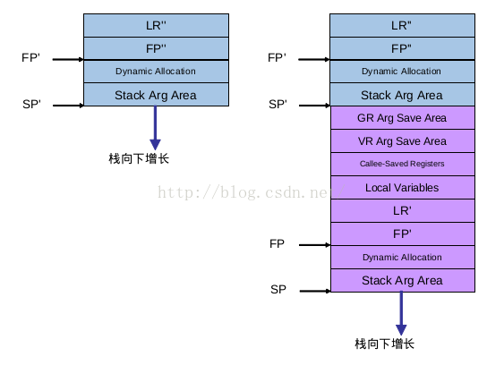

# More About Final Lab：理解 AArch64 ABI

> **注意**
>
> 这是对 AArch64 ABI 的详细介绍，感兴趣的同学可以阅读了解。**但不要求掌握，因为这不是 Final Lab 的一部分，和评分也没有关系，也不要求在报告中体现。**


> **参考文档**
>
> - Application Binary Interface for the Arm® Architecture：<https://github.com/ARM-software/abi-aa>
> - 干货 | ARMv8 架构下程序运行时栈帧布局：<https://zhuanlan.zhihu.com/p/31826566>

## 1. ABI 是什么
ABI（Application Binary Interface）是指应用程序二进制接口。ABI 定义了包括二进制程序的二进制格式、调用约定、系统调用、动态链接、名称修饰、异常处理等在内的各项标准。ABI 使得不同编译器编译的二进制程序可以在同一平台上运行、相互调用，也使得调试器（如 GDB）可以调试任意符合同一套 ABI 的二进制程序。

**不精确地说，与常见的 HTTP API 相类比，如果说一个二进制库的 API 方法（如 `get_user()`、`search()`、`login()`）对应于不同的 HTTP API 接口（例如 `/user/1`、`/search`、`/login`），那么 ABI 就对应于 HTTP API 的请求规范（如 HTTP 协议）。**

## 2. AArch64 ABI
我们关心的是 AArch64 ABI，即 AArch64 架构下的 ABI。AArch64 ABI 的标准文档可以在 [这里](https://github.com/ARM-software/abi-aa/releases) 找到。其中，我们比较在意的是**过程调用标准**（Procedure Call Standard，PCS）文档，它定义了不同编译器之间应该使用怎样统一的数据格式（例如，不同长度整数、数组的对齐方式）和调用约定（Calling Convention）。

关于数据格式规范，现在使用的 C 编译器已经帮我们遵守了，不用过分操心。需要我们自己注意的是**调用约定**，它规定了函数调用时，参数的传递方式、寄存器的使用方式、返回值的传递方式等等。这些规定对于我们实现汇编函数非常重要。此前的实验中，我们对大家的汇编函数的格式并没有严格的规定，这可能导致 GDB 无法正确理解我们的寄存器和函数栈帧的布局，从而无法显示甚至显示错误的函数栈帧结构。**例如，如果你发现自己的内核在中断中调试时，GDB 无法正确显示中断前的调用栈追踪（Stack Trace），那么很可能是因为你的中断函数没有遵守 AArch64 ABI 的调用约定。**

## 3. AArch64 ABI 的调用约定
以下内容基本是对官方文档的概括。考虑到文档也在不断更新，所以这里不会给出具体的章节号，只会给出大致的位置。

在 *The Base Procedure Call Standard* 中介绍了一些基本的约定。它们包括：

### 3.1 寄存器规范
#### 3.1.1. 通用寄存器
通用寄存器的作用和解释如下：

| 寄存器 | 特殊别名 | 在过程调用标准中的作用 |
|--------|---------|------------------------|
| SP     |         | 栈指针。                  |
| r30    | LR      | 链接寄存器。              |
| r29    | FP      | 帧指针。                  |
| r19…r28|         | 被调用者保存的寄存器。     |
| r18    |         | 平台寄存器（如果需要的话）；否则作为临时寄存器。 |
| r17    | IP1     | 第二个「过程内调用」的临时寄存器；在其他时候可能用作临时寄存器。 |
| r16    | IP0     | 第一个「过程内调用」的临时寄存器；在其他时候可能用作临时寄存器。 |
| r9…r15 |         | 临时寄存器。                |
| r8     |         | 间接结果存储位置寄存器。    |
| r0…r7  |         | 参数/结果寄存器。            |

其中 r0…r18 基本包括了参数、结果和临时寄存器，都由调用者负责保存（有关「过程内调用」和「平台寄存器」的意义，我们按下不表。这里当成普通的临时寄存器即可）。r19…r29 由被调用者负责保存。

> **你知道吗？**
>
> SP 看起来很特殊，它没有对应的寄存器。按照我们的表格顺序，它似乎应该属于 r31 的别名。然而我们也许也听说过 r31 是值永远为零的零寄存器（xzr，e**X**tended **Z**ero **R**egister，主要用于作为操作数的占位符来简化指令集），而且在汇编代码中写 r31 是合法的。那么，r31、sp、xzr 到底是什么关系呢？
>
> 其实，r31 同时可以代指 xzr 和 sp，这取决于使用它的指令是什么。在 *ARM Reference manual* 中，如果一个指令的操作数写作 Xn，则 r31 是 xzr；如果写作 SP，则 r31 是 sp；如果写作 Xn|SP，则汇编器会自己选择一个，通常来说是 xzr。由于这样模糊性的存在，在编写汇编代码的时候，应当明确使用 xzr 或 sp，而不是 r31。r31 只应存在于 AArch64 的二进制指令中。

余下的 SP 和 LR 比较特殊，我们考虑两种情况。为了方便，我们把调用者和被调用者分别称为 B() 和 C()，调用关系是 A() -> B() -> C()：

**如果 B 和 C 都是普通的、同一异常等级的函数（即这是一次普通的函数调用）**，那么当 C 开始执行时，sp 自然无需保存。lr 目前是 B 刚刚设置好的地址，在实际的调用约定中，C 需要保存它，以便能后续使用该寄存器用作其他用途。

**如果 B 和 C 都是不同异常等级的函数（例如这是一次中断，C 是中断 Handler）**，那么 C 需要保存 sp，这是因为 B 可能使用着和 C 不同的 sp（例如，B 在 EL0，而 C 在 EL1，这时就必须保存好 sp_el0）。也需要保存 lr，因为中断时 lr 的语义已经变了：它是 B 需要返回到的地方（即 lr = A 中的 B() 语句的下一行），内核要返回的地方其实是 elr_el1（elr_el1 = B 中被中断的地方），而不是 lr。


#### 3.1.2. 浮点（又称：SIMD 矢量）寄存器
AArch64 还有 32 个 128 位浮点寄存器 v0…v31（这里的 v 指 Vector，即矢量寄存器）。调用约定中规定，只有 q8…q15（即 v18…v15 的低 64 位）是需要被调用者保存的，其他都是调用者保存。

当然，如果你在编写的是内核中断逻辑，仍然需要视情况储存所有浮点寄存器。

不过，在我们的实验中基本不涉及浮点寄存器的使用，**所以完全不保存也无伤大雅**。这里不再赘述。

#### 3.1.3. 其他寄存器
AArch64 还规定了一些其他特殊的寄存器，例如储存上次浮点运算异常状态的 FPSR、储存线程局部标识的 tpidr_el0 等等。这些视实验要求储存即可。

### 3.2. 栈结构
AArch64 ABI 中将内存依照用途划分为几个区域：

- 代码
- 只读的静态数据
- 可写的静态数据
- 堆
- 栈（每个线程一个）

这里我们只关心栈结构，它是 GDB 等调试工具追踪函数调用历史的重要依据。

一个函数帧由以下部分组成：



其中蓝色和紫色分别为调用者和被调用者正常运行时的函数栈部分。GR 和 VR 分别对应调用者所负责保存的通用寄存器和矢量寄存器；从 Callee-Saved Registers 到 FP' 分别是被调用者保存的各种寄存器、被调用者的局部变量和帧信息；FP 以下的内容则是动态帧分配（`alloca`）和变长参数的存储区域。

值得关注的是其中的**帧信息**。它包括两个关键值：

1. LR'：链接寄存器，即返回到调用者的什么位置继续执行；
2. FP'：帧指针，即上一层函数的栈帧的起始位置。


## 4. Bonus：要让 GDB 能够调试内核中断，需要做什么
让我们梳理一下 GDB 如何利用这些信息来追踪函数调用历史，从而帮助我们利用 GDB 调试中断函数。

假设现在函数被断点暂停了，栈在上面右图中的状态。

1. 读取当前的 PC，利用 PC 解析出现在中断位置的函数名和行号，显示出来；
2. 读取当前的 FP 的值；
3. 根据 FP 指向的栈位置，读出 FP' 和 LR'；
4. 利用 LR' 解析出对应的函数名和行号，显示出来；
5. 利用 FP' 指向的栈位置，读出 FP'' 和 LR''；
6. 重复 4、5 步骤，直到栈顶或者无法读取。

写成伪代码：

```c
print(pc);
fp = read_fp();
while (fp != 0) {
    fp = read_mem(fp);
    lr = read_mem(fp + 8);
    print(lr);
}
```

总而言之，GDB 会利用 FP 寄存器和栈中的内容，逐层追踪函数调用历史。

因此，**为了让 GDB 能够调试内核中断，我们需要让中断时的栈结构符合上述要求**。

具体来说，在 `trap_entry` 中，储存完各类寄存器的值之后，我们需要额外做以下两件事：

1. 将 fp 和 elr_el1 按上述要求放在栈顶（因为 elr_el1 才是真正的返回地址），从而使布局和普通函数调用一致；
2. 将 fp 指向栈顶。这样进入中断处理的 C 函数后，它会自动将 fp 的值保存到栈中，从而使得 GDB 能够正确找到我们的 fp 和 elr_el1。

这样，GDB 就能够正确地跨过中断的间隙，继续向上追踪调用历史了。