# 10.9 实验课

本文档中提到的参考文档均已上传 elearning 。

## 时钟中断

（异常处理和异常向量表部分更详细的介绍可以去看仓库里面的 trap.explained.md）

### 异常处理

*更详细的介绍可以参考文档 aarch64_exception_and_interrupt_handling_100933_0100_en.pdf 的 9*
*Interrupt handling*

在我们的实验中，异常（trap 和 interrupt）处理统一按照下面的模式：

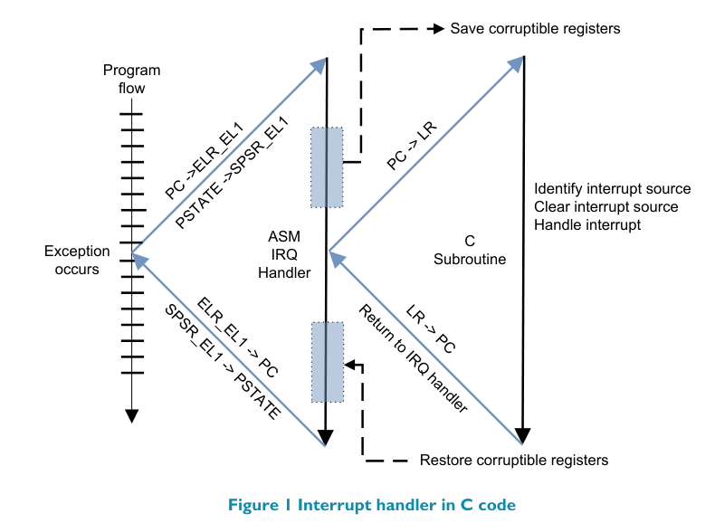

**对应我们实验中的代码**

### 异常向量表

*更详细的介绍可以参考文档 aarch64_exception_and_interrupt_handling_100933_0100_en.pdf 的 5 AArch64 exception vector table*

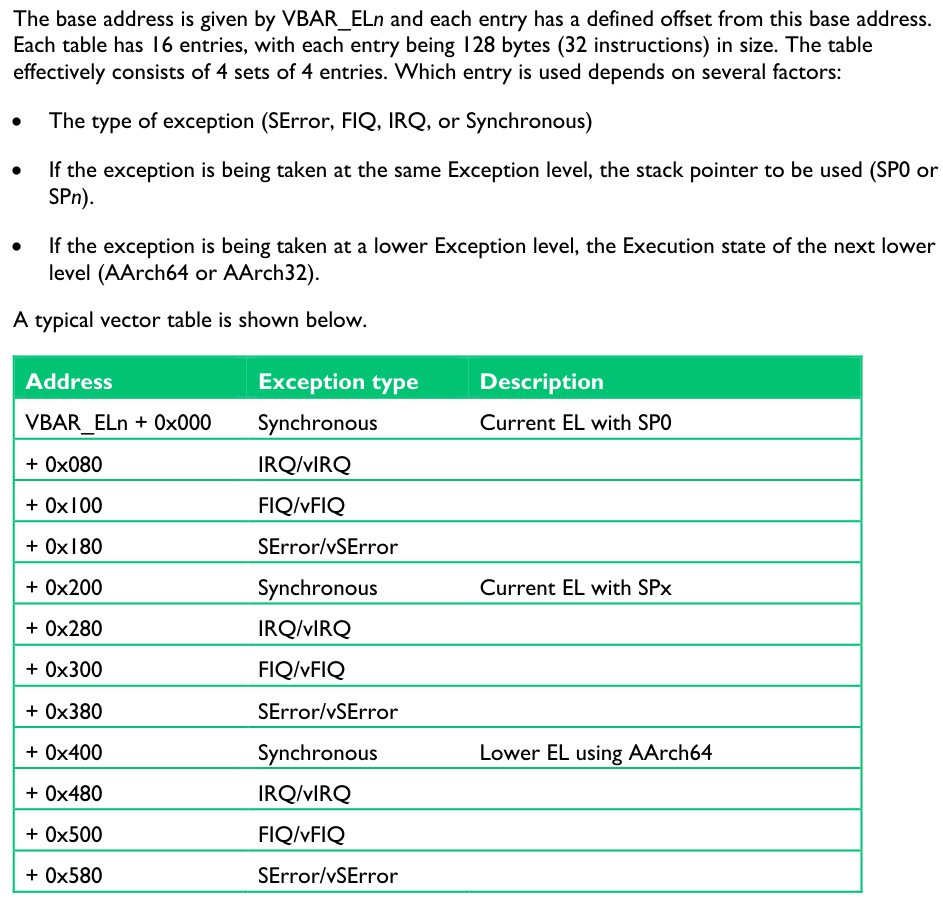

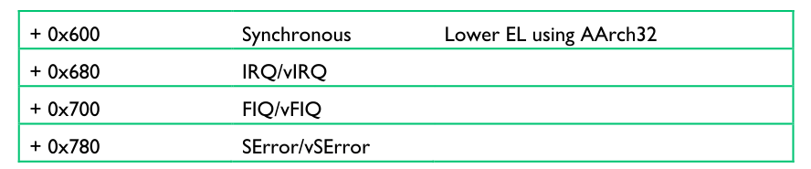

**对应我们的实验：初始化 vbar_el1，内核异常和用户态异常（只使用了这两个）**

### AArch64 时钟中断的设置与触发

*更详细的介绍可以参考文档 Arm Architecture Registers.pdf*

先看三个寄存器。

#### CNTP_CTL_EL0

Control register for the EL1 physical timer.

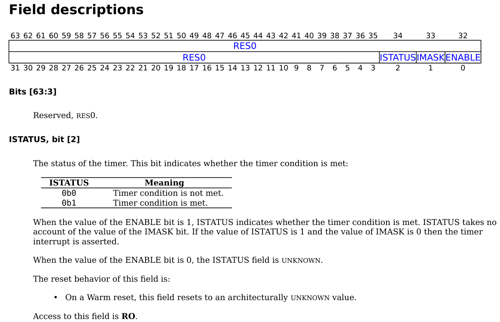

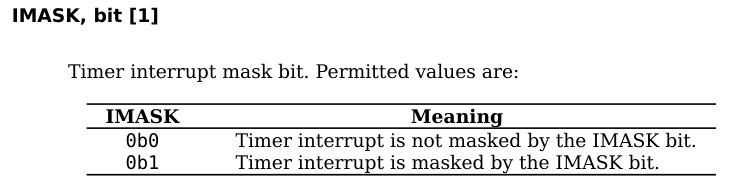

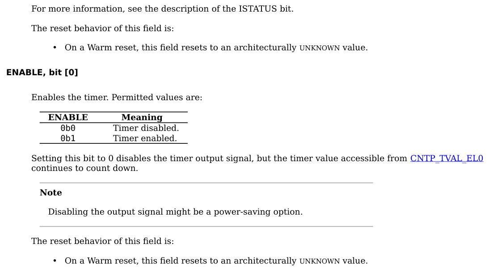

> Disabling interrupts means that you have disabled the source of interrupt.
> Masking means that you(CPU) are not going to handle the interrupts until it is
> unmasked.（interrupt controller 里面有一个队列）

#### CNTPCT_EL0

Holds the 64-bit physical count value.

可以理解为该寄存器中的值会以固定频率+1

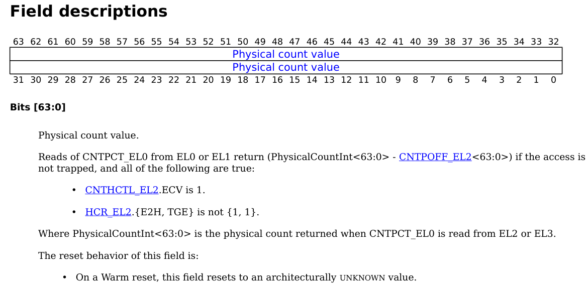

#### CNTP_CVAL_EL0

Holds the compare value for the EL1 physical timer.

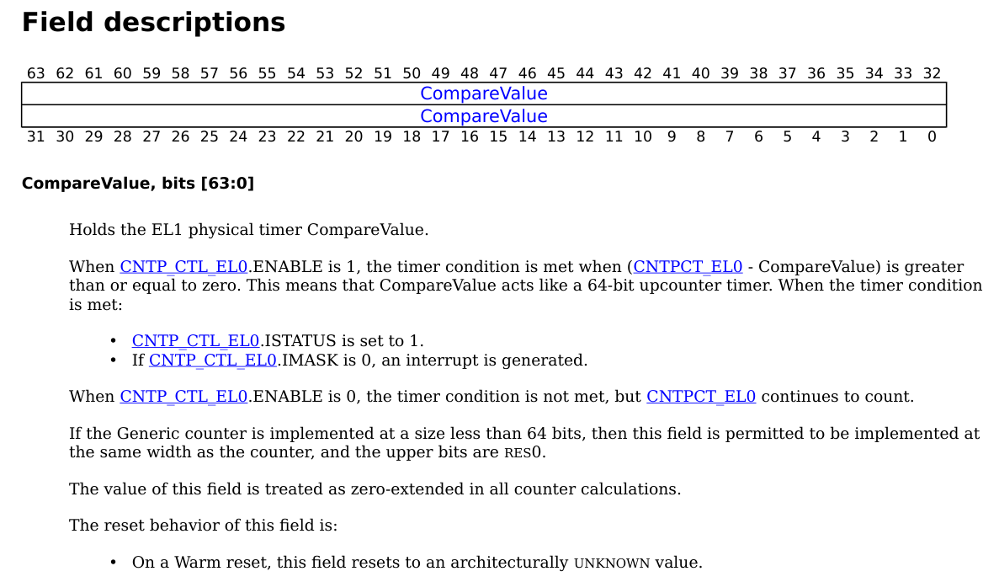

#### CNTP_TVAL_EL0

Holds the timer value for the EL1 physical timer.

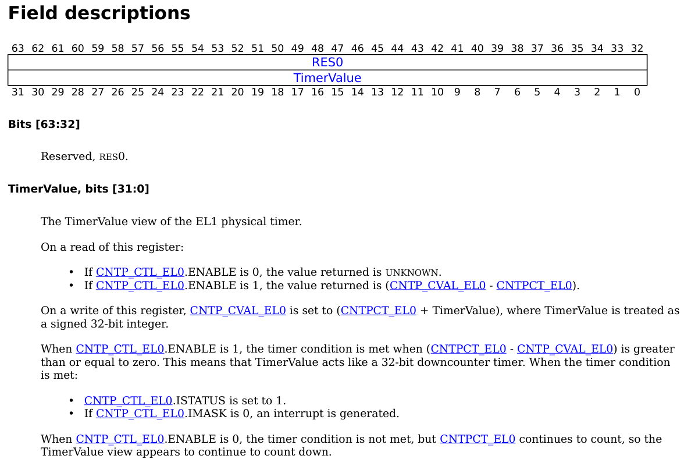

对应我们的实验

## 地址翻译

### 基本流程

*更详细的介绍可以参考文档 ARM64 Manual.pdf 的 D8.2.1 Translation table walk 和 D8.2.7 Translation using the 4KB granule*

地址翻译的基本流程是 MMU 去查页表，MMU 根据页表得出虚拟地址对应的物理地址（TLB 作为页表的缓存，这里我们认为它是透明的，不去管它）。

现代体系结构中大多使用多级页表，那么多级页表在地址翻译时是怎么样的呢？

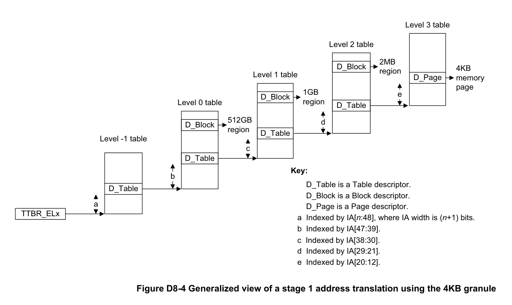

（我们实验中没有 -1 级页表，地址翻译从 0 级页表开始，从上述翻译的过程中也能看出来为什么页的地址需要对齐）

使用多级页表，在地址翻译时需要多次查页表，前几次查找页表得到的都是下一级页表的地址，最后一次查找页表才能得出物理地址。

多级页表较为灵活：更高级的页表可以直接映射到内存块来实现更大的页。

### TTBR0 和 TTBR1

*更详细的介绍可以参考文档 ARM64 Manual.pdf 的 D8.2.4 Selection between TTBR0_ELx and TTBR1_ELx when two VA ranges are supported*

两个页表基址寄存器（在我们的实验中存放 0 级页表的地址），分别存放低地址的页表和高地址高地址的页表。

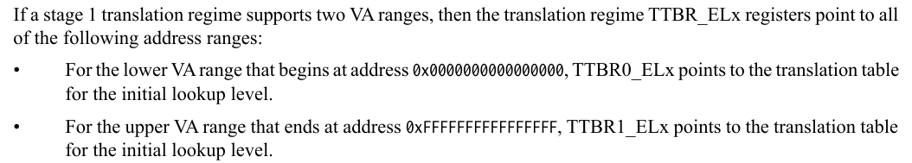

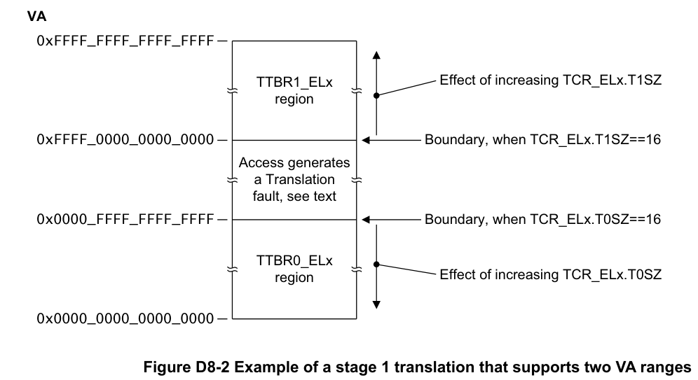

### PTE 格式

*更详细的介绍可以参考文档 ARM64 Manual.pdf 的 D8.3 translation table descriptor formats*

#### Table descriptor format

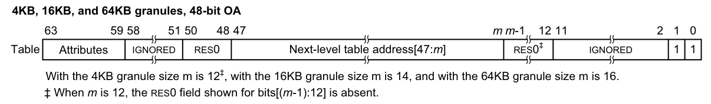

（重点关注 Next-level table address 和低两位的 1 即可）

#### Block descriptor format

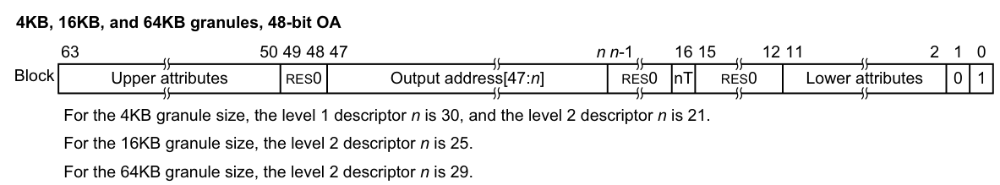

（重点关注 Output address，Lower attributes 和低两位的 01 即可）

（我们的实验中不会用到 block descriptor）

#### Page descriptor format

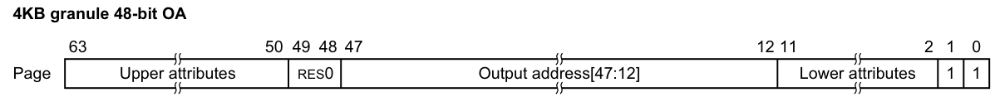

（重点关注 Output address，Lower attributes 和低两位的 11 即可）

#### Lower attributes

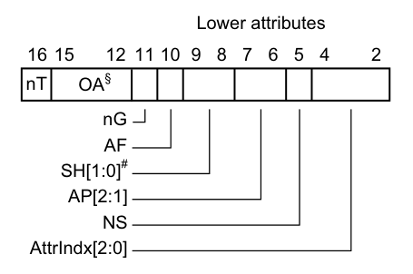

- **AF**

对应的内存区域是否被访问过

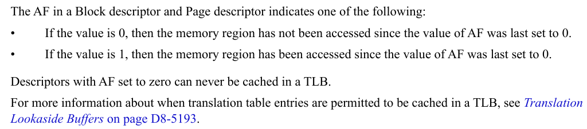

- **SH**

共享属性（考虑多CPU的系统）

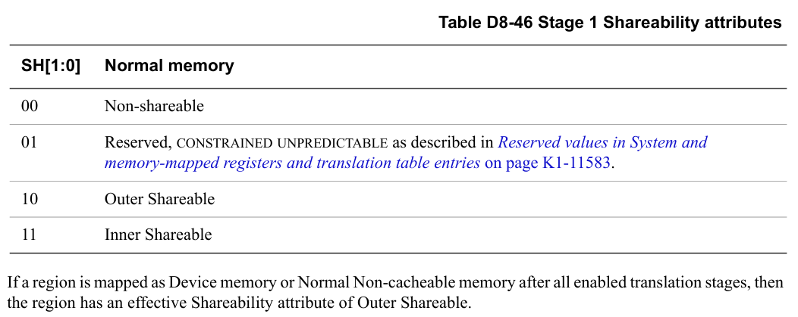

- **AP**

访问权限

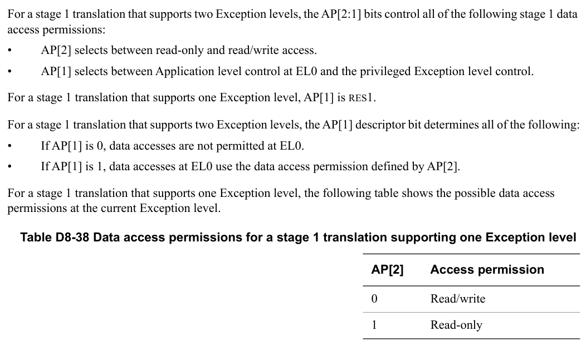

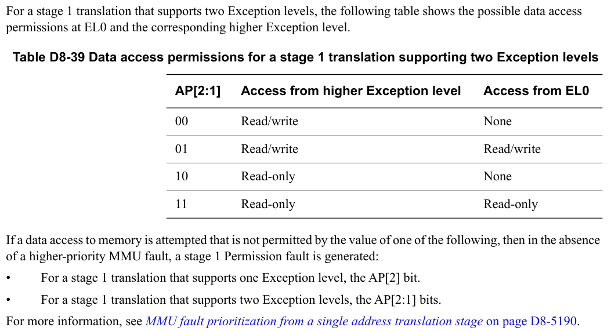

- **低两位**

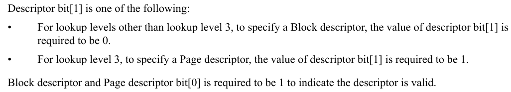

**回到 start.S 开启 MMU 的瞬间**

x/1xg 0x81000
0x81000:        0x0000000000082003

翻译地址时，去物理地址 0x0000000000082000 查 1 级页表

修改 `linker.ld`

x/1xg 0x81000
0x81000:        0x0000000000092003

翻译地址时，去物理地址 0x0000000000092000 查 1 级页表（但这里根本不是 1 级页表（1 级页表在 0x0000000000082000）而是全 0），无法完成地址翻译，无法继续执行。