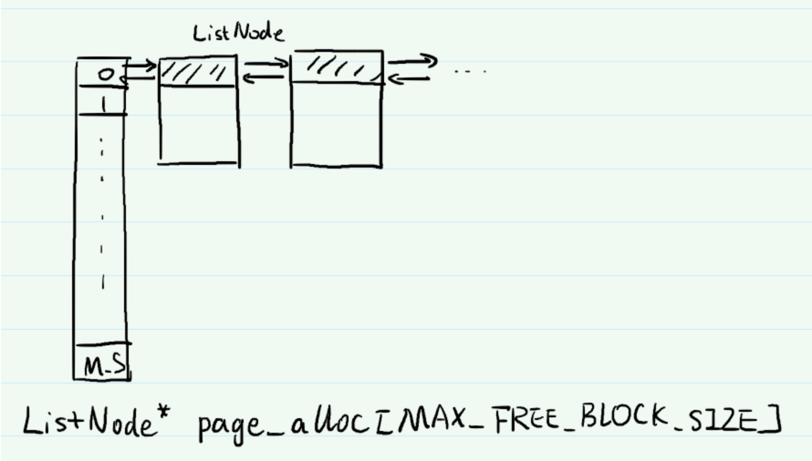
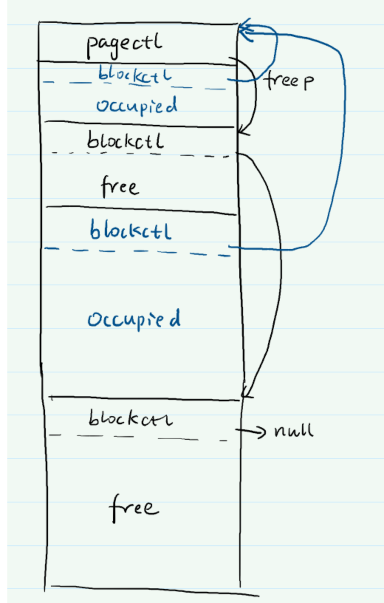

# Lab 2 - Allocator

 在本实验中，我们将管理系统中的物理内存，实现物理内存分配器供后续代码使用，并开始考虑并发安全问题。

## 代码下载

运行以下命令进行代码的拉取与合并
```
# 拉取远端仓库
git fetch --all
# 提交你的更改
git add.
git commit -m "your commit message"
# 切换到新lab的分支
git checkout lab2
# 新建一个分支，用于开发
git checkout -b lab2-dev
# 引入你在上个lab的更改
git merge lab1-dev
```

 如果合并发生冲突，请参考错误信息自行解决。如果网上下载较慢，可以用服务器 /share 文件夹下的仓库，不过会涉及到仓库之间的合并(本次应该直接替换即可)，请自行搜索解决。


## Physical Memory

`driver/memlayout.h`中给出了内存空间的布局，`EXTMEM-PHYSTOP`这段物理地址内的内存为可用的物理内存。考虑到我们的内核代码也要占用内存，实际可供分配的物理地址为`end-PHYSTOP`。

因为CPU开启了MMU，我们的代码里访问内存时，必须使用内核虚拟地址，不能直接使用物理地址。可以使用`aarch64/mmu.h`中定义的`K2P`宏将内核虚拟地址转换为物理地址，使用`P2K`将物理地址转换为内核虚拟地址。

> 也许你已经注意到了，我们的内核页表极度敷衍，和直接使用物理地址就差一个偏移量的区别——属于被迫的——为什么处理器要要求内核也使用页表？

为方便后续使用，我们需要将完整的物理内存切分为`PAGE_SIZE`大小并按`PAGE_SIZE`对齐的物理页，以物理页为单位管理物理内存。

> PAGE_SIZE是内存页的大小，定义在aarch64/mmu.h，我们暂时还不需要深入了解内存分页机制。 

## Allocator

对于常见的内存需求而言，完整的物理页还是太大了。就如我们在C中使用过的`malloc`和`free`一样，内存分配器动态分配若干物理页，将其切分为程序分配指定大小的内存块，并回收程序释放的内存块用于再分配。分配的内存块地址必须与大小对齐，即：如果需要分配的内存大小是 2 的倍数，则地址也要是 2 的倍数；如果大小是 4 的倍数，地址也要是 4 的倍数；如果大小是 8 的倍数，则地址也要是 8 的倍数。和内存页的分配不同，一般的分配器不需要 16 字节以上的对齐，如大小是 16 的倍数，则地址只需是 8 的倍数。（为什么？）

与C中的`free`相同，我们需要实现的内存分配器不要求程序在释放内存块时告知内存块的大小，所以你需要在合适的地方保存内存块大小。

<u>此外，我们保证助教直接提供或要求大家写的代码中需要通过内存分配器分配的内存大小均在`1 - PAGE_SIZE/2`之间。</u>


下面简单介绍一下如何实现：

我们可以对页的剩余空间信息进行记录。构建一个hash表，key为剩余的空间大小，value为一个链表，将所有剩余空间为key值的页面记录下来。这样我们可以以一个几乎O(1)的时间来找到留有相应空间大小的块。



对于任何一个页，我们可以构造一个页头记录信息，并为分配好的每一小块记录一个块信息。这样我们就可以将空余的空间重复利用起来（页的剩余空间大小为所有free块中最大的，以保证正确性）。



## 并发安全

本实验中，我们要求大家考虑并发安全问题。测试时， 4 个核会同时分配和释放内存 ，你编写的内存分配器必须考虑到这种情况。

如下面代码，我们希望这段代码找到处于`AVAILABLE`状态的元素，并将其标记为`USING`


```c
for (int i = 0 ; i < N; i++)
    if (mem[i] == AVAILABLE)
    {
        mem[i] = USING;
        return i;
    }
```

容易看出，当两个核同时执行这段代码时，可能两个核会返回同一个元素，导致重复分配。

解决并发问题的常用办法是为代码加锁，锁的设计保证同时只能有一个CPU取得锁，也就只能有 一个CPU执行锁保护下的代码。

```c
acquire_spin_lock(mem_lock);
for (int i = 0 ; i < N; i++)
    if (mem[i] == AVAILABLE)
    {
        mem[i] = USING;
        return i;
    }
release_spin_lock(mem_lock);
```

原子操作简介：https://gcc.gnu.org/onlinedocs/gcc/_005f_005fatomic-Builtins.html

另一种思路是为不同CPU维护不同的数据结构

```c
for (int i = 0 ; i < N; i++)
if (mem[cpuid()][i] == AVAILABLE)
{
    mem[cpuid()][i] = USING;
    return i;
}
```

（还可以有其他的思路吗？）

>  上面举例用的代码与本实验并没有太大关联。

## <u>作业与提交</u>

我们为大家提供了一份编写好的`main.c`文件，请将这份文件与你的代码进行merge，也可以直接用它替换你的代码。如果选择merge，请确保得到的代码可以正确完成bss、early init、init，并在其后让所有CPU进入`idle_entry`。

请在`kernel/mem.c`中编写代码，完成下面函数：


+ `void* kalloc_page()` 分配以`PAGE_SIZE`对齐的`PAGE_SIZE`大小内存（即分配一整个物理 页）。

+ `void kfree_page(void*)` 释放`kalloc_page`分配的物理页。

**借助前面实现的kalloc_page函数 ，请继续完成下面函数：**

+ `void* kalloc(isize)` 使用你的分配器分配指定大小的物理内存块。我们保证所需物理内存 块的大小符合Allocator一节中的约定。另请注意Allocator一节中的对齐要求。

+ `void kfree(void*)` 释放`kalloc`分配的物理内存块。

本实验所需的简易的内存分配器就由上述4个函数组成。要求算法复杂度为O(1)。

上述四个函数的定义已经在`kernel/mem.c`中给出，部分函数中已经写了一些与测试代码有关的内容，请不要随意更改。

>  因为我们的测试使用kalloc_page和kfree_page中的统计代码记录分配器所用物理页的数 量，因此要求大家的分配器使用上述两个函数获取内存资源。
我们保证测试时大小超过PAGE_SIZE/20的内存块不超过1/10，因此你不必过于关注物理页不够大的问题。如确有实现大页分配的需求，请与助教沟通，更新相关的统计代码。

一些可能有用的提示：

+  如有需要，你可以自行在mem.c中使用define_early_init定义并注册初始化函数。（为什么不能用define_init？）

+ **测试时会用 4 个核同时分配和释放内存，请务必关注并发安全问题。**

+ 也许你会用上`common/list.h`里提供的数据结构。

+ 我们不要求在`kfree`中调用`kfree_page`释放物理页，只要保证`kfree`释放的内存块能被kalloc再分配即可完成要求。如果你实现了释放物理页，可以将其作为你的创新点写进报告里。

` idle_entry`中已经编写了测试代码。如果测试通过，你将看到`PASS`和你的物理页用量。

物理页用量受随机因素和测试数据影响，不能完全代表大家的分配器好坏。**物理页的用量越少越好**，我们设定的满分线为1700 ， **低于 1700 即可得到这部分全部分数** ，未达到该线将会少量扣分（真的是少量扣分，不鼓励大家卷）。剩余部分将结合实验报告综合评估。

**提交：将实验报告提交到 elearning 上，格式为 学号 -lab2.pdf。**

**从lab2开始，用于评分的代码以实验报告提交时为准。如果需要使用新的代码版本，请重新提交实验报告。**

**<u>截止时间： 9 月 29 日 11:59。</u>逾期提交将扣除部分分数。**


报告中可以包括下面内容

+ 代码运行效果展示

+ 实现思路和创新点

+ 思考题

+ 对后续实验的建议

+ 其他任何你想写的内容


报告中不应有大段代码的复制。如有使用本地环境进行实验的同学，请联系助教提交代码（最好可以给个git仓库）。使用服务器进行实验的同学，助教会在服务器上检查，不需要另外提交代码。

